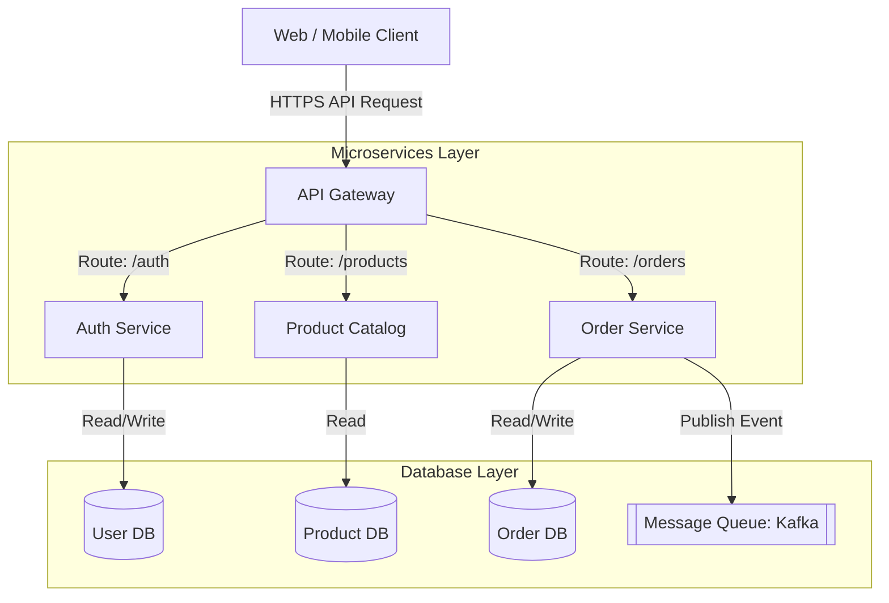
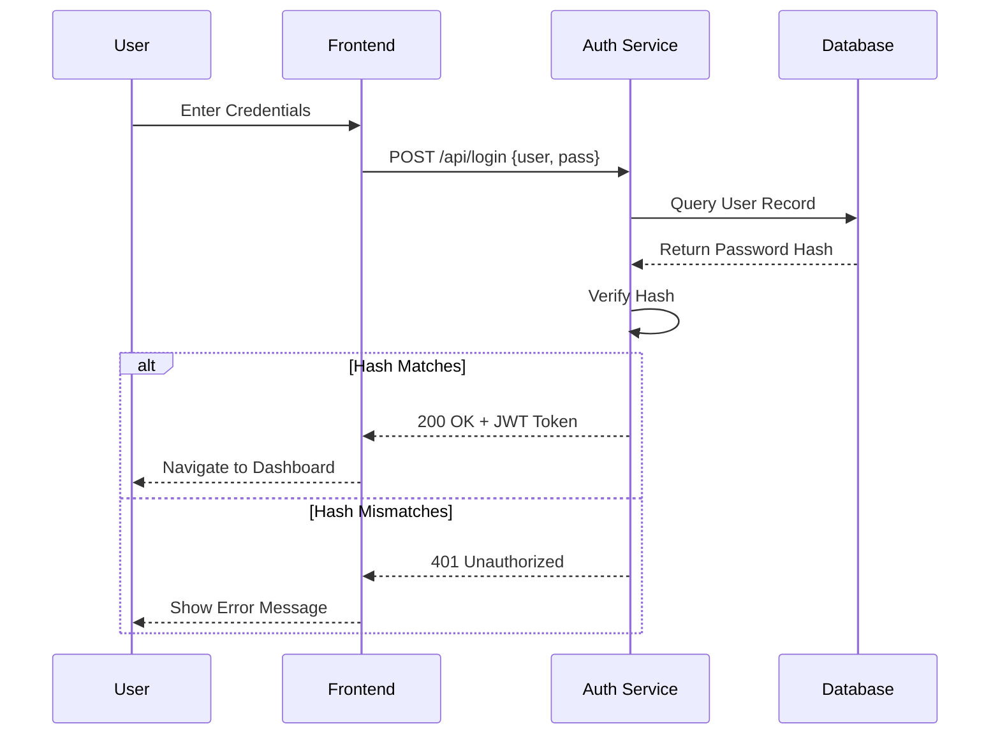

# Architecture Diagram Generator

When the user wants to create an architecture diagram, system design diagram, or flow chart (especially when triggered by the `/architecture-diagram` command), follow these instructions to generate a high-quality [Mermaid.js](https://mermaid.js.org/) diagram.

## Instructions

1. **Analyze the Request**: Understand the components, their relationships, and the data flow requested by the user. If the request is vague, analyze the current codebase/context to infer the architecture.
2. **Choose the Right Diagram Type**:
   - `graph TD` / `graph LR` (Flowchart): Good for general system architecture, dependencies, and data flow.
   - `sequenceDiagram`: Good for API interactions, network requests, and temporal communication between services.
   - `classDiagram`: Good for object-oriented system design and class structures.
   - `erDiagram`: Good for database schemas.
3. **Use Mermaid Syntax**:
   - Output the diagram using standard Mermaid markdown blocks: ` ```mermaid ... ``` `
   - Keep the diagram visually clean. Use subgraphs to group related components (e.g., Frontend, Backend, Database).
   - Use descriptive labels on arrows (e.g., `A -->|HTTPS GET| B`).
   - For complex systems, add some minimal styling using `classDef` if it helps distinguish layers (optional).

## Example: General Architecture (Flowchart)

**User Input:** `/architecture-diagram draw a simple e-commerce backend`

**Response:**
Here is the architecture diagram for a simple e-commerce backend:



## Example: API Flow (Sequence Diagram)

**User Input:** `/architecture-diagram sequence of a user login`

**Response:**
Here is the sequence diagram for the user login flow:



## Important Rules
- Always wrap the diagram code in ` ```mermaid ` and ` ``` `. Cursor natively supports rendering this format.
- Ensure the syntax is valid. Do not use unescaped special characters inside node names.
- Keep the design modular and logical.