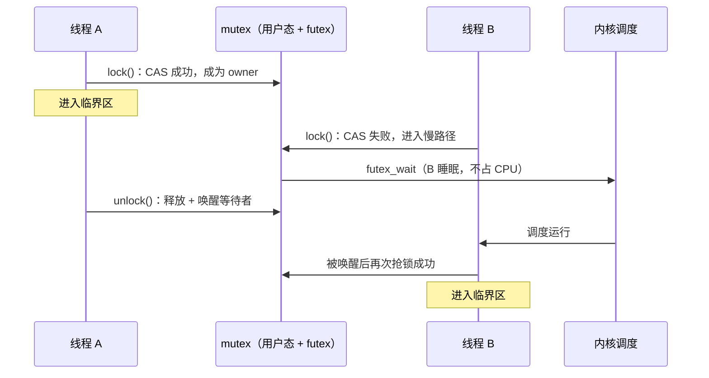

# C++ 锁：面试速记与原理详解

> **适用方向**：Android / iOS / FFmpeg 音视频开发，C++ 多线程，Pipeline 优化  
> **难度**：⭐⭐⭐⭐  
> **预计阅读**：速记 10 分钟｜全文 35 分钟  
> **关联项目**：[[核心-直播性能优化]] 中的 `DispatchQueue2` 异步发送队列、编码线程与网络线程解耦

---

## 📌 第一部分：面试速记（考前 10 分钟扫一遍）

### 一句话核心

> C++ 锁的本质是保护共享状态，面试重点不是“会不会用 mutex”，而是能不能根据临界区长短、读写比例、等待策略和死锁风险选择合适的同步手段。

### 高频考点速查清单

1. **mutex 家族怎么选** 🔥🔥🔥 — 普通互斥用 `mutex`，重入用 `recursive_mutex`，超时用 `timed_mutex`，读多写少用 `shared_mutex`
2. **RAII 锁封装** 🔥🔥🔥 — 默认 `lock_guard`，要配条件变量或中途解锁用 `unique_lock`，多锁用 `scoped_lock`
3. **条件变量** 🔥🔥🔥 — 不是锁；等的是业务条件且 `wait` 会释放 mutex；mutex 争锁不能替代（占锁等会死锁）
4. **死锁四条件** 🔥🔥🔥 — 互斥、请求保持、不剥夺、循环等待；工程上用固定加锁顺序或 `std::lock` 破循环等待
5. **递归锁** 🔥🔥 — 能解决同线程重入，但通常暴露模块边界不清，不建议滥用
6. **shared_mutex** 🔥🔥 — 读多写少才有收益，写频繁或临界区很短时可能比普通 mutex 更慢
7. **自旋锁 vs 互斥锁** 🔥🔥 — 临界区极短用自旋可能更快，长等待必须用 mutex，避免白白烧 CPU
8. **atomic vs mutex** 🔥🔥🔥 — 单变量无复合不变量可用 atomic，多变量一致性和复杂临界区用 mutex
9. **两线程争锁过程** 🔥🔥 — 先 CAS 快路径抢到进临界区；失败者入队 futex 睡眠；`unlock` 唤醒后再抢锁
10. **volatile** 🔥🔥 — 防编译器优化访问，用于 MMIO 等；**不能**当多线程同步，跨线程用 `atomic` / `mutex`

### 面试官常问问题 + 标准口语化回答

---

#### 开场题：请介绍一下 C++ 里的锁 / 同步机制

**考察意图：** 看你是只会背 API，还是理解「锁在保护什么、怎么选、怎么和工程结合」。这道题往往决定后面追问的深度。

**🗣️ 面试标准回答：**

> "C++ 里和锁相关的同步，我一般会分三层来讲：
>
> **第一层是互斥锁本体**——`std::mutex` 是最常用的，保护共享数据在临界区内不被其他线程同时改坏；特殊场景才用 `recursive_mutex`（同线程重入）、`timed_mutex`（不能无限等）、`shared_mutex`（读多写少）。
>
> **第二层是 RAII 封装**——实际写代码我几乎不手写 `lock/unlock`，而是用 `lock_guard` 做简单作用域加锁，`unique_lock` 配条件变量或需要中途解锁的场景，多把锁一起拿用 `scoped_lock` 防死锁。
>
> **第三层是协作原语**——`condition_variable` 本身不是锁，但必须配 mutex，用来做「等条件成立再干活」，比如队列空/满、任务就绪；单变量简单状态可以用 `atomic`，但一旦涉及多个字段的不变量，还是 mutex 更稳。
>
> 所以对我来说，锁的本质不是 API，而是**保护共享状态和不变量**；选锁要看临界区长短、读写比例、能不能阻塞、有没有死锁风险。"

**👨‍💻 面试官追问：**

> Q: 你说的「不变量」是什么意思？
> A: 比如队列的 `size` 和内部链表必须一致，编码线程 push 和网络线程 pop 不能看到「size 已经加了但节点还没挂上」这种中间态——锁保证的是数据结构的完整状态，不是某一行代码。

---

#### 必考题：你平时常用哪些锁？为什么？

**考察意图：** 验证你是不是「只会 mutex」，以及有没有真实项目经验（音视频、Pipeline 里队列、配置、回调很常见）。

**🗣️ 面试标准回答：**

> "日常工程里我**用得最多的是这三类**：
>
> 1. **`std::mutex` + `lock_guard`**——默认组合。保护发送队列、状态机、编码器参数等普通临界区，离开作用域自动解锁，简单不容易漏。
> 2. **`std::mutex` + `unique_lock` + `condition_variable`**——生产者消费者、异步任务队列、线程池「有活再唤醒」。`wait` 一定带 predicate（`while` 或 lambda），防虚假唤醒；通知用 `notify_one` / `notify_all` 配合 mutex 保护的状态位。
> 3. **`std::atomic`**——只做计数、标志位、单变量状态（例如 `std::atomic<bool> running_`），**不**用它替代「队列 + 多个字段」这种复合结构。
>
> **偶尔用、但要说明理由的**：
> - `shared_mutex`：配置表、元数据缓存这类**读多写少**才上；写频繁或临界区极短反而可能更慢。
> - `scoped_lock` / `std::lock`：同时锁多把 mutex 时防死锁。
> - `recursive_mutex`：能不用就不用，通常说明模块边界该拆而不是靠递归锁糊过去。
>
> 我在直播 / FFmpeg Pipeline 里典型用法是：编码线程和网络线程之间用 **mutex 保护队列 + 条件变量做背压**（队列满时阻塞 push、空时阻塞 pop），锁里只做内存操作，不做网络 I/O 和重回调。"

**💡 可结合项目的 15 秒补充（有追问再说）：**

> "比如发送队列：`push` / `pop` 用同一把 `mutex`，队列深度变化用 `condition_variable` 通知对端；锁持有时间控制在微毫秒级内存操作，避免在锁里调 JNI 或等 socket。"

**👨‍💻 面试官追问：**

> Q: 为什么不用 `shared_mutex` 把队列也做成读写锁？
> A: 队列的 push/pop 都是写操作，没有「多读少写」的收益；读写锁适合配置、索引、统计快照这类读远多于写的结构。

> Q: `lock_guard` 和 `unique_lock` 你怎么选？
> A: 不需要 `wait`、不需要提前 `unlock`、不需要转移锁所有权 → `lock_guard`；要配条件变量、要超时、要 `defer_lock` 配合 `std::lock` → `unique_lock`。

---

#### 概念题：mutex、lock_guard、unique_lock 分别是什么关系？

**考察意图：** 区分「锁类型」和「锁的管理类」，很多人这里会混。

**🗣️ 面试标准回答：**

> "`mutex` 是**锁本身**，负责互斥；`lock_guard` / `unique_lock` 是 **RAII 包装器**，在构造时加锁、析构时解锁。
> - `lock_guard`：轻量，不能提前解锁，不能配条件变量。
> - `unique_lock`：可 `unlock()`、可 `defer_lock`、可移动，**必须**用它才能 `condition_variable::wait`。
> - C++17 的 `scoped_lock`：一次锁住多把 mutex，内部用 `std::lock` 避免死锁。
>
> 所以关系是：**mutex 管互斥，RAII 类管生命周期和用法组合**。"

---

#### 高频题：什么是死锁？你在项目里怎么避免？

**🗣️ 面试标准回答：**

> "死锁需要同时满足四个条件：互斥、占有且等待、不可剥夺、循环等待。工程上我主要破**循环等待**：
> 1. **固定加锁顺序**——如果线程 A 先锁 `mtx1` 再锁 `mtx2`，所有线程都按这个顺序；
> 2. **一把梭**——`std::scoped_lock lock(m1, m2)` 或 `std::lock` + `std::adopt_lock`，让标准库按统一顺序拿锁；
> 3. **能拆锁就拆锁**——减少同时持有多把锁的时间，锁粒度别太大。
>
> 另外锁里不调用户回调、不做 I/O，也能降低「拿着锁等别人、别人又等这把锁」的概率。"

---

#### 协作题：条件变量和锁怎么配合？虚假唤醒怎么处理？

**🗣️ 面试标准回答：**

> "条件变量解决的是：**mutex 只能互斥，不能高效地『等某个业务条件』**。标准写法是：
> 1. 用 `unique_lock` 锁住保护条件的 mutex；
> 2. `wait(lock, predicate)`，在 lambda 里检查「队列非空」「任务就绪」等；
> 3. 修改条件的一方：先改状态（仍持有锁），再 `notify`。
>
> 必须用 `while` 或带 predicate 的 `wait`，因为存在**虚假唤醒**，以及 `notify` 时条件可能还没被设置好。记住：**notify 只是提示，条件真假要看 mutex 保护的状态**。"

---

#### 选型题：atomic 和 mutex 怎么选？无锁是不是更高级？

**🗣️ 面试标准回答：**

> "`atomic` 适合**单个变量**的原子读写信令、计数、标志；一旦要维护「多个字段同时成立」的不变量（队列、状态机），就用 `mutex`。
>
> 无锁不是默认更高级——我会先看 profiling 锁是不是瓶颈。Pipeline 里瓶颈常在 I/O、编解码硬件，队列用 mutex 更稳；只有竞争被证明是热点、且数据结构足够简单时，才考虑 lock-free，并接受 ABA、内存序、回收策略等维护成本。"

---

#### 收尾题：shared_mutex / 自旋锁 / 递归锁你怎么看待？

**🗣️ 面试标准回答（简短版）：**

> - **`shared_mutex`**：读多写少才有意义；写多或临界区很短时，别为了「听起来高级」硬上。
> - **自旋锁**：临界区极短、且几乎不会睡眠等待时可能更快；长等待会白烧 CPU，一般用 `mutex` 让线程睡眠。
> - **`recursive_mutex`**：能解同线程重入，但常说明设计该拆函数；面试里我会说「知道，但优先重构而不是递归锁」。"

---

## 一、锁先解决什么问题？

多线程最大的风险不是“同时运行”，而是**同时读写同一份共享状态**。

比如一个发送队列：

```cpp
std::queue<Packet> queue;
```

如果编码线程正在 `push`，网络线程同时 `pop`，队列内部的指针、大小、节点关系可能被改到一半。轻则数据错乱，重则崩溃。

锁要解决的就是这件事：

> 在某一段代码执行期间，保证共享数据处于一致状态，不让其他线程同时破坏它。

这段需要保护的代码叫**临界区**。

```cpp
std::mutex mtx;
std::queue<Packet> queue;

void pushPacket(Packet pkt) {
    std::lock_guard<std::mutex> lock(mtx);
    queue.push(std::move(pkt)); // 临界区：修改共享队列
}
```

这里真正需要保护的不是函数本身，而是 `queue` 这个共享资源。

---

## 二、C++ 里 mutex 都有哪些？怎么选？

### 1. 先用白话理解 mutex 家族

C++ 标准库里的 mutex 可以理解成一组“不同能力的互斥锁”。最基础的是 `std::mutex`，其他锁都是在它基础上增加能力。

| 类型 | 白话解释 | 适合场景 |
|---|---|---|
| `std::mutex` | 普通互斥锁，一个线程拿到锁，其他线程只能等 | 绝大多数普通临界区 |
| `std::recursive_mutex` | 同一个线程可以重复加同一把锁 | 递归调用、回调重入，但不建议滥用 |
| `std::timed_mutex` | 拿不到锁时可以等一段时间，超时放弃 | UI 线程、实时线程、不能无限阻塞的场景 |
| `std::recursive_timed_mutex` | 递归锁 + 超时能力 | 很少用，复杂度高 |
| `std::shared_mutex` | 读写锁，多个读线程并发，写线程独占 | 读多写少的配置、缓存、索引 |
| `std::shared_timed_mutex` | 带超时能力的读写锁 | C++14 时代的读写锁选择 |

### 2. 选择口诀

面试里可以按 3 个问题回答：

1. **是不是普通临界区？** 是，优先 `std::mutex`。
2. **同一个线程会不会重复进入同一把锁？** 会，才考虑 `recursive_mutex`。
3. **是不是读很多、写很少？** 是，才考虑 `shared_mutex`。
4. **这个线程能不能一直等锁？** 不能，才考虑 `timed_mutex`。

注意：锁不是越高级越好。`shared_mutex`、`recursive_mutex` 都比普通 `mutex` 更复杂，用错会更慢。

### 3. `recursive_mutex` 到底解决什么？

它解决的是**同一个线程重复加同一把锁**的问题。

```cpp
std::mutex mtx;

void inner() {
    std::lock_guard<std::mutex> lock(mtx);
}

void outer() {
    std::lock_guard<std::mutex> lock(mtx);
    inner(); // 同一个线程再次 lock 同一把 mutex，会把自己卡住
}
```

如果把 `std::mutex` 换成 `std::recursive_mutex`，同一个线程可以重复加锁。它内部会维护：

```text
owner thread id + lock counter
```

也就是记录“当前锁属于哪个线程，以及这个线程重复 lock 了几次”。

但递归锁通常不是最佳设计。更推荐拆成两个函数：

```cpp
class Cache {
public:
    void update() {
        std::lock_guard<std::mutex> lock(mtx_);
        updateLocked();
    }

private:
    void updateLocked() {
        // 默认调用方已经持锁
    }

    std::mutex mtx_;
};
```

这样边界更清楚：对外函数负责加锁，内部函数不再重复加锁。

### 4. 两个线程同时抢同一把 `std::mutex`，争锁过程是什么样的？

下面用两个线程 A、B 都调用 `mtx.lock()` 为例，把「抢锁」拆成用户代码、标准库实现、操作系统调度三层来看。面试不必背每一行 libc 源码，但要能说清**谁先拿到、另一个在干什么、什么时候睡、什么时候醒**。

#### 4.1 先约定：锁在内存里是什么状态

`std::mutex` 在标准层面只保证「互斥 + 不可拷贝」，具体实现由平台 libc 提供。以 Linux / Android 上常见的 **pthread_mutex**（glibc / bionic）为例，可以把它想成一把锁的两种宏观状态：

```text
未锁定（unlocked）  →  任意一个线程都可以通过「抢」成为持有者
已锁定（locked）    →  只有一个 owner 线程；其他线程必须等待
```

底层通常用**原子变量**（或等价原语）表示 locked / unlocked，并在竞争激烈时借助内核的 **futex**（快速用户态互斥）做「睡下去 / 被唤醒」，避免所有失败线程一直空转占满 CPU。

#### 4.2 时间线：A 先抢到，B 后到的典型过程

```cpp
std::mutex mtx;
int shared = 0;

// 线程 A                          // 线程 B
void threadA() {                     void threadB() {
    mtx.lock();   // ①                mtx.lock();   // ③
    ++shared;     // 临界区             // （此时还在等）
    mtx.unlock(); // ⑤                }
}
```



按步骤说明：

| 步骤 | 发生的事 | 线程 A | 线程 B |
|---|---|---|---|
| ① | A 调用 `lock()` | 走**快路径**：原子 CAS 把锁从 unlocked 改成 locked，**立刻返回**，进入临界区 | — |
| ② | B 稍后也调用 `lock()` | 仍在临界区 | 走**快路径**尝试 CAS → **失败**（锁已被 A 持有） |
| ③ | B 进入**慢路径** | 继续执行 | 把自己登记进这把锁的**等待队列**，再通过 futex **阻塞睡眠**；此时 B 不再烧 CPU 空转 |
| ④ | A 执行 `unlock()` | 原子把锁标回 unlocked，并从等待队列里**挑一个**线程（通常是 B）做唤醒 | B 仍在睡眠或刚被标记为可运行 |
| ⑤ | B 被调度器拉起 | A 已离开临界区 | 从 futex 返回后**再次尝试**加锁（可能再 CAS 一次）；成功则 `lock()` 返回，B 进入临界区 |

要点：

- **不是**「两个线程同时改同一份队列数据」——mutex 保证同一时刻只有一个线程在临界区里。
- B 的 `lock()` 在③之前**不会返回**（除非用 `try_lock` / `timed_mutex` 等非阻塞接口）；看起来就像卡在 `lock()` 那一行。
- 若 A 从未 `unlock()`，B 会一直等 → 逻辑死锁；若 A、B 互相等对方手里的另一把锁 → 经典死锁（见第五节）。

#### 4.3 快路径 vs 慢路径（面试常问的「用户态还是内核态」）

| 路径 | 何时走 | 大致行为 | 成本 |
|---|---|---|---|
| **快路径** | 锁空闲，或竞争很轻 | 仅在用户态用原子指令（如 CAS）抢锁，成功则直接返回 | 纳秒级，无系统调用 |
| **慢路径** | 锁已被占用 | 先可能**短暂自旋**（实现相关），仍拿不到则入队 + **futex 阻塞** | 涉及内核调度，微秒级甚至更长 |

因此：

- **无竞争**时，`std::mutex` 并不等于「每次 lock 都 syscall」。
- **高竞争**时，失败线程会睡眠 + 唤醒，带来**上下文切换**；这就是第七节说的 mutex 可能「重」的原因。

#### 4.4 和 `lock_guard` / `unique_lock` 的关系

```cpp
std::lock_guard<std::mutex> lock(mtx);  // 构造 ≈ mtx.lock()
// ...
// 析构 ≈ mtx.unlock()
```

争锁过程发生在 **`lock()` 调用点**，与用不用 RAII 无关；RAII 只是保证作用域结束一定 `unlock()`，避免忘记放锁导致其他线程永久阻塞。

#### 4.5 两线程「几乎同时」抢锁，谁赢？

从程序员视角是「同时」，从 CPU 视角是**总线 / 缓存一致性协议 + 原子 CAS** 保证只有一个成功者：

- 两个线程都对「锁字」做 CAS，**只有一个**能把 unlocked → locked 成功；
- 失败者进入慢路径排队，**不会**出现两个线程都以为自己持锁（除非用错了 `recursive_mutex` 或实现有 bug，标准库实现可假定正确）。

公平性：普通 `std::mutex` **不保证**严格 FIFO，一般近似「谁先被唤醒谁先试」；极端高竞争下可能出现某个线程等很久（饥饿），工程上靠缩短临界区缓解，而不是指望 mutex 公平调度。

#### 🗣️ 面试标准回答（争锁过程）

> “两个线程调 `mtx.lock()` 时，底层会先用原子 CAS 走快路径抢锁。先抢到的那一个进入临界区，另一个 CAS 失败就走慢路径：进等待队列，通过 futex 睡眠，不再占 CPU。持锁线程 `unlock` 时释放锁并唤醒等待者，被唤醒的线程再抢一次锁，成功才从 `lock()` 返回。所以 mutex 无竞争时主要在用户态，竞争激烈时才会有内核阻塞和上下文切换。我用 `lock_guard` 只是为了 RAII 自动 unlock，争锁机制发生在 `lock()` 本身。”

### 🗣️ 面试标准回答

> “C++ 的 mutex 我一般按访问模型选。普通临界区优先用 `std::mutex`，它最简单、开销也最低。如果同一个线程在持锁状态下还会间接调用同一段加锁逻辑，才考虑 `recursive_mutex`，但我会尽量避免，因为它往往说明模块边界不清。线程不能无限等待时，比如 UI 线程、实时采集线程，可以用 `timed_mutex` 做超时兜底。读多写少的配置表、缓存、索引类数据，可以用 `shared_mutex`，让多个读线程并发，提高吞吐。”

### 💡 实战案例补充（来自 [[核心-直播性能优化]]）

> “在 4K 直播项目里，我实现过一个 `DispatchQueue2` 异步发送队列，把编码完的帧从编码线程移交到网络发送线程。这个场景本质是生产者-消费者：编码线程 push，网络线程 pop。临界区非常短，只是改队列指针和计数，所以我用最朴素的 `std::mutex` + `std::condition_variable` 就够了。这里不是大量线程同时读同一份数据，所以没必要上 `shared_mutex`；读写锁本身更重，用错了反而会降低性能。”

---

## 三、`lock_guard`、`unique_lock`、`scoped_lock` 怎么选？

C++ 推荐不要手写 `lock()` / `unlock()`，而是用 RAII 对象管理锁。

RAII 的意思是：对象构造时加锁，析构时自动解锁。

```cpp
void foo() {
    std::lock_guard<std::mutex> lock(mtx);
    // 中间即使 return 或抛异常，函数退出时也会自动 unlock
}
```

### 1. 三个常见封装

| 类型 | 特点 | 典型场景 |
|---|---|---|
| `std::lock_guard` | 最简单，构造加锁，析构解锁，不能手动提前解锁 | 普通临界区 |
| `std::unique_lock` | 更灵活，可以延迟加锁、提前解锁、移动所有权 | 条件变量、复杂加锁流程 |
| `std::scoped_lock` | C++17，引入多个 mutex 时自动避免死锁 | 同时锁多把锁 |

### 2. 默认用 `lock_guard`

```cpp
std::mutex mtx;
int count = 0;

void inc() {
    std::lock_guard<std::mutex> lock(mtx);
    ++count;
}
```

这种场景不需要中途解锁，不需要等待条件变量，`lock_guard` 最合适。

### 3. 条件变量必须用 `unique_lock`

```cpp
std::mutex mtx;
std::condition_variable cv;
std::queue<int> q;

int pop() {
    std::unique_lock<std::mutex> lock(mtx);
    cv.wait(lock, [] { return !q.empty(); });

    int value = q.front();
    q.pop();
    return value;
}
```

`condition_variable::wait` 需要临时释放锁，让其他线程有机会 `push` 数据；被唤醒后再重新加锁。所以它需要能“解锁再加锁”的 `unique_lock`，不能用死板的 `lock_guard`。

### 4. 多锁场景用 `scoped_lock`

错误写法：

```cpp
void transfer(Account& from, Account& to, int money) {
    std::lock_guard<std::mutex> l1(from.mtx);
    std::lock_guard<std::mutex> l2(to.mtx);
    // 如果另一个线程反过来先锁 to 再锁 from，可能死锁
}
```

C++17 推荐：

```cpp
void transfer(Account& from, Account& to, int money) {
    std::scoped_lock lock(from.mtx, to.mtx);
    from.balance -= money;
    to.balance += money;
}
```

`scoped_lock` 内部使用类似 `std::lock` 的算法，能避免多个 mutex 的循环等待。

### 🗣️ 面试标准回答

> “我的默认选择是 `lock_guard`，因为它简单、轻量，作用域结束自动解锁。如果要配 `condition_variable`，或者需要延迟加锁、提前解锁、转移锁所有权，就用 `unique_lock`。如果需要同时锁多把 mutex，C++17 之后我会用 `scoped_lock`，因为它能一次性管理多把锁，并避免常见的多锁死锁问题。”

---

## 四、条件变量：`condition_variable` 是怎么配合锁的？

### 1. 条件变量不是锁

`condition_variable` 的作用是让线程睡眠等待某个条件成立。它本身不保护数据，必须配合 mutex。

典型生产者-消费者模型：

```cpp
class BlockingQueue {
public:
    void push(Packet pkt) {
        {
            std::lock_guard<std::mutex> lock(mtx_);
            queue_.push(std::move(pkt));
        }
        cv_.notify_one();
    }

    Packet pop() {
        std::unique_lock<std::mutex> lock(mtx_);
        cv_.wait(lock, [this] { return !queue_.empty(); });

        Packet pkt = std::move(queue_.front());
        queue_.pop();
        return pkt;
    }

private:
    std::mutex mtx_;
    std::condition_variable cv_;
    std::queue<Packet> queue_;
};
```

### 2. 和 mutex 争锁很像，为什么还要条件变量？

争锁时「失败 → 睡眠 → 被唤醒 → 再抢锁」，和 `cv.wait()` 的流程**看起来**很像，所以容易误以为「有 mutex 就够了」。其实两者等的对象不同，**不能互相替代**。

| 对比项 | `mutex::lock()` 争锁 | `condition_variable::wait()` |
|---|---|---|
| **在等什么** | 等**锁本身**变空闲 | 等**业务条件**成立（如 `!queue_.empty()`） |
| **等待时是否持锁** | 不持锁（还没抢到） | **先持锁**，确认条件不成立后**主动释放** mutex 再睡 |
| **谁负责唤醒** | 持锁线程 `unlock()` | 其他线程改完共享状态后 `notify_one()` / `notify_all()` |
| **主要作用** | 互斥，保护临界区 | 协调线程：**不占着锁空等**，让别的线程能改条件 |

一句话区分：

> **mutex 解决「同一时刻谁能进临界区」；条件变量解决「什么时候该睡、什么时候该醒」，且睡眠时必须把 mutex 让出来。**

#### 2.1 只用 mutex 等「队列非空」会怎样？

**错误写法 1：持锁忙等（必死锁）**

```cpp
Packet pop() {
    std::lock_guard<std::mutex> lock(mtx_);
    while (queue_.empty()) {
        // 一直占着 mtx_，生产者 push 永远拿不到锁
    }
    // ...
}
```

消费者占着锁等数据，生产者进不了临界区去 `push` → **逻辑死锁**。

**错误写法 2：解锁后轮询（能跑，但很差）**

```cpp
Packet pop() {
    while (true) {
        std::unique_lock<std::mutex> lock(mtx_);
        if (!queue_.empty()) {
            // pop ...
            return pkt;
        }
        lock.unlock();
        std::this_thread::sleep_for(1ms); // 或 yield
    }
}
```

问题：

- 队列为空时线程反复 **加锁 → 发现空 → 解锁 → 睡一会 → 再加锁**，大量无效唤醒，**空转烧 CPU**（移动端还加重发热）。
- `sleep` 多久很难调：太短像忙等，太长增加延迟。
- 若在 `unlock` 之后、`再次 lock` 之前，生产者 `push` 并发了通知，没有条件变量配合时容易写出**丢唤醒**（lost wakeup）的竞态。

**正确写法：mutex + 条件变量**

```cpp
cv_.wait(lock, [this] { return !queue_.empty(); });
```

`wait` 在**原子语义**下完成一件事：「当前已持锁 + 条件不成立 → **释放 mutex 并进入睡眠** → 被 notify 后 **重新抢锁** → 再检查条件」。  
这样消费者睡眠时，生产者可以拿锁 `push` 并 `notify_one()`，消费者被精准唤醒，而不是盲等锁或盲轮询。

#### 2.2 底层都像 futex，为什么语义仍不同？

Linux / Android 上，mutex 阻塞和条件变量等待**都可能**落到 futex 睡眠/唤醒，所以**实现层**相似；**语义层**不同：

```text
mutex 争锁：  等的是「锁字」从 locked → unlocked
cv wait：     等的是「predicate 为真」，且等待期间 mutex 必须已释放
```

可以打个比方：

- **mutex** ≈ 厕所门锁：大家抢的是「门能不能进」。
- **条件变量** ≈ 排队等「里面有人用完且打扫好了」（业务条件）；等待时你得**把门让出来**，别人才能进去把条件变好（往队列里放数据）。

#### 2.3 分工总结（面试可背）

```text
mutex              → 保护 queue_，保证 push/pop 时数据结构一致
condition_variable → 在「队列空 / 队列满」时让线程睡眠，在状态变化时唤醒
```

二者是**组合关系**，不是二选一：

- 没有 mutex：条件检查和修改没有互斥，数据竞争。
- 没有条件变量：要么占锁死等，要么解锁轮询/手写信号，易死锁、费 CPU、易写丢唤醒。

#### 🗣️ 面试标准回答（为何还要条件变量）

> “mutex 争锁和 cv.wait 底层都可能走 futex，但等的不是一回事。mutex 等的是锁空闲；条件变量等的是业务条件，比如队列非空，而且 wait 时会先释放 mutex，这样生产者才能拿锁 push。如果消费者一直占着 mutex 等队列非空，生产者进不来，就死锁了。如果解锁后自己 sleep 轮询，又会空转烧 CPU，还可能丢唤醒。所以生产者-消费者必须用 mutex 保护数据，用条件变量做‘条件不满足就睡、条件变了就醒’，两者配合，不能互相替代。”

### 3. `wait` 内部做了什么？

```cpp
cv.wait(lock, predicate);
```

可以理解成：

1. 先检查 `predicate()` 是否成立。
2. 如果不成立，自动释放 mutex，然后线程睡眠。
3. 被 `notify_one` 或 `notify_all` 唤醒。
4. 重新抢 mutex。
5. 再检查 `predicate()`。
6. 条件成立才继续往下执行。

所以 `wait` 的核心是：

> 睡眠时不能一直占着锁，否则生产者永远没机会拿锁修改条件。

### 4. 必须防虚假唤醒

错误写法：

```cpp
if (queue_.empty()) {
    cv_.wait(lock);
}
```

问题是线程可能没有真正满足条件也被唤醒，这叫**虚假唤醒**。正确写法：

```cpp
cv_.wait(lock, [this] { return !queue_.empty(); });
```

或者：

```cpp
while (queue_.empty()) {
    cv_.wait(lock);
}
```

### 🗣️ 面试标准回答

> “`condition_variable` 不是用来保护共享数据的，它是用来阻塞和唤醒线程的。共享队列还是要靠 mutex 保护。`wait` 的关键点是：等待时会释放 mutex，被唤醒后会重新抢锁。使用时一定要用 while 或 predicate 版本，因为条件变量允许虚假唤醒。如果用 if 判断，线程可能在条件不满足时继续执行，导致空队列 pop 这类 bug。”

---

## 五、死锁：怎么产生？怎么避免？

### 1. 死锁四个必要条件

死锁同时满足四个条件才会发生：

| 条件 | 含义 |
|---|---|
| 互斥 | 资源一次只能被一个线程持有 |
| 请求保持 | 线程拿着资源 A，又去等资源 B |
| 不剥夺 | 线程拿到的锁不能被外部强行抢走 |
| 循环等待 | 线程 1 等线程 2，线程 2 又等线程 1 |

经典例子：

```cpp
std::mutex m1;
std::mutex m2;

void threadA() {
    std::lock_guard<std::mutex> l1(m1);
    std::lock_guard<std::mutex> l2(m2);
}

void threadB() {
    std::lock_guard<std::mutex> l1(m2);
    std::lock_guard<std::mutex> l2(m1);
}
```

如果 A 拿到 `m1`，B 拿到 `m2`，接下来 A 等 `m2`，B 等 `m1`，就互相卡死。

### 2. 工程上怎么避免？

常用方法有三种：

1. **固定加锁顺序**：所有地方都先锁 A，再锁 B。
2. **使用 `std::scoped_lock` 或 `std::lock`**：一次性申请多把锁。
3. **缩小临界区**：不要持锁做耗时操作，比如网络 I/O、磁盘 I/O、复杂回调。

推荐写法：

```cpp
void safeTransfer(Account& a, Account& b, int money) {
    std::scoped_lock lock(a.mtx, b.mtx);
    a.balance -= money;
    b.balance += money;
}
```

### 3. 锁里不要做回调

这是工程里很常见的坑：

```cpp
void notifyListeners() {
    std::lock_guard<std::mutex> lock(mtx_);
    for (auto& listener : listeners_) {
        listener->onEvent(); // 危险：回调里可能再次调用当前对象
    }
}
```

更安全的做法是：锁内拷贝快照，锁外执行回调。

```cpp
void notifyListeners() {
    std::vector<std::shared_ptr<Listener>> snapshot;
    {
        std::lock_guard<std::mutex> lock(mtx_);
        snapshot = listeners_;
    }

    for (auto& listener : snapshot) {
        listener->onEvent();
    }
}
```

这样既缩短临界区，也避免回调重入导致死锁。

### 🗣️ 面试标准回答

> “死锁本质是多个线程形成循环等待。工程上我主要从两个方向避免：第一是所有多锁场景规定统一加锁顺序，或者直接用 `std::scoped_lock` 一次锁多把锁；第二是缩短临界区，锁里只改共享状态，不做网络 I/O、不做耗时计算、不调用外部回调。尤其是回调很危险，因为你不知道回调内部会不会反过来调用当前模块，容易出现重入死锁。”

---

## 六、`shared_mutex`：读写锁适合什么场景？

### 1. 普通 mutex 的问题

假设有一个配置表，100 个线程都在读，只有 1 个线程偶尔更新。

用普通 `mutex`：

```text
读线程之间也互斥
```

这会浪费并发能力。

### 2. 读写锁的模型

`shared_mutex` 有两种锁法：

| 操作 | 锁类型 | 是否互斥 |
|---|---|---|
| 读 | `std::shared_lock` | 多个读线程之间不互斥 |
| 写 | `std::unique_lock` | 写线程独占，和读写都互斥 |

示例：

```cpp
class Config {
public:
    std::string get(const std::string& key) const {
        std::shared_lock<std::shared_mutex> lock(mtx_);
        auto it = values_.find(key);
        return it == values_.end() ? "" : it->second;
    }

    void set(std::string key, std::string value) {
        std::unique_lock<std::shared_mutex> lock(mtx_);
        values_[std::move(key)] = std::move(value);
    }

private:
    mutable std::shared_mutex mtx_;
    std::unordered_map<std::string, std::string> values_;
};
```

### 3. 什么时候别用？

不要看到“读写锁”就觉得一定更快。下面这些场景不适合：

- 临界区特别短，只是 push/pop 一个队列。
- 写操作很频繁，读写锁会频繁升级为独占。
- 数据结构本质不是“读多写少”，比如生产者-消费者队列。
- 对写延迟敏感，而实现又可能偏向读者，导致写者饥饿。

### 🗣️ 面试标准回答

> “`shared_mutex` 适合读多写少，比如配置表、缓存、索引。读线程用 `shared_lock`，可以并发；写线程用 `unique_lock`，必须独占。但我不会滥用读写锁，因为它比普通 mutex 更重。如果临界区很短，或者写很频繁，读写锁可能没有收益，甚至更慢。像生产者-消费者队列这种 push/pop 模型，用普通 mutex 更合适。”

---

## 七、自旋锁 vs 互斥锁

### 1. mutex 为什么可能“重”？

`std::mutex` 在竞争激烈时，拿不到锁的线程可能会被操作系统挂起，等锁释放后再唤醒。

这个过程可能涉及：

```text
用户态 -> 内核态 -> 线程睡眠 -> 调度切换 -> 再唤醒
```

上下文切换有成本，通常是微秒级。

### 2. 自旋锁是什么？

自旋锁拿不到锁时不睡眠，而是在 CPU 上循环检查。

```cpp
class SpinLock {
public:
    void lock() {
        while (flag_.test_and_set(std::memory_order_acquire)) {
            // busy wait
        }
    }

    void unlock() {
        flag_.clear(std::memory_order_release);
    }

private:
    std::atomic_flag flag_ = ATOMIC_FLAG_INIT;
};
```

优点：如果锁马上释放，可以避免线程睡眠和唤醒开销。

缺点：如果锁迟迟不释放，自旋线程会一直占 CPU。

### 3. 怎么选？

| 场景 | 建议 |
|---|---|
| 临界区极短，几十纳秒到几百纳秒 | 可以考虑自旋 |
| 临界区里有 I/O、等待、复杂计算 | 必须用 mutex |
| 移动端设备，CPU 和功耗敏感 | 谨慎自旋 |
| 不确定锁持有时间 | 默认 mutex |

### 🗣️ 面试标准回答

> “自旋锁适合临界区极短的场景，因为它避免了线程睡眠和唤醒的上下文切换。但它的问题是拿不到锁时会一直烧 CPU。移动端音视频场景里 CPU 和功耗都很敏感，所以我不会随便用自旋锁。只要临界区可能变长，或者里面有 I/O、回调、条件等待，就应该用 mutex。”

---

## 八、atomic 和锁是什么关系？

### 1. atomic 不是锁的平替

`std::atomic` 适合保护单个变量的原子读写：

```cpp
std::atomic<bool> stop{false};

void requestStop() {
    stop.store(true, std::memory_order_release);
}

void worker() {
    while (!stop.load(std::memory_order_acquire)) {
        // do work
    }
}
```

这种停止标记非常适合用 atomic。

### 2. 多变量不变量更适合锁

比如队列有两个状态：

```cpp
std::queue<Packet> queue;
size_t size;
```

你需要保证：

```text
queue 的真实元素数量 == size
```

这就是复合不变量。只用 atomic 很难维护，mutex 更合适。

```cpp
std::mutex mtx;

void push(Packet pkt) {
    std::lock_guard<std::mutex> lock(mtx);
    queue.push(std::move(pkt));
    size = queue.size();
}
```

### 3. 面试容易问的边界

`shared_ptr` 的引用计数是线程安全的，但对象本身不是线程安全的。

```cpp
auto p = std::make_shared<std::vector<int>>();
```

多个线程拷贝 `p` 没问题，因为引用计数原子增减。

但多个线程同时：

```cpp
p->push_back(1);
```

仍然需要加锁，因为 vector 本身不是线程安全的。

### 🗣️ 面试标准回答

> “atomic 和 mutex 解决的问题不完全一样。atomic 适合单个变量，比如停止标记、引用计数、简单状态位。mutex 适合保护一组共享状态，尤其是存在多个变量之间的一致性约束时。不要因为 atomic 看起来轻量就硬写 lock-free，复杂 lock-free 很容易写错内存序，维护成本也高。”

### 4. `volatile` 是什么？（易与多线程同步混淆）

很多人把 `volatile` 当成「多线程可见性关键字」，这多半是受了 **Java `volatile`** 的影响。在 **C++** 里，它的含义和用途完全不同，**不能**用来替代 `std::atomic` 或 `std::mutex`。

#### 4.1 一句话定义

`volatile` 告诉编译器：**对这个对象的每次读写都必须按源码语义发生，不能把访问优化掉或合并掉**。

它解决的是**编译器优化**问题，不是 CPU 缓存一致性，也不是线程互斥。

```cpp
volatile int *gpio_reg = reinterpret_cast<volatile int *>(0x40001000);
*gpio_reg = 1;  // 编译器必须真的生成一次写内存/设备的指令
int v = *gpio_reg; // 编译器不能省略这次读
```

#### 4.2 `volatile` 到底保证了什么、不保证什么

| 能力 | `volatile` | `std::atomic` | `std::mutex` |
|---|---|---|---|
| 防止编译器省略/合并访问 | ✅ | ✅（对原子对象） | ✅（临界区内） |
| 读-改-写原子性（如 `i++`） | ❌ | ✅ | ✅ |
| 跨线程 happens-before | ❌ | ✅（配合内存序） | ✅ |
| 保护多个变量的复合不变量 | ❌ | 通常 ❌ | ✅ |

#### 4.3 正确使用场景（C++ 里就该这么用）

**① 内存映射 I/O / 硬件寄存器（最常见）**

外设寄存器的值可能被硬件随时改变，和程序里的普通变量不是一回事。若不用 `volatile`，编译器可能认为「刚写过、再读没意义」而删掉读操作。

```cpp
// 典型：DMA 状态寄存器、GPIO、codec 控制寄存器
volatile uint32_t *status = reinterpret_cast<volatile uint32_t *>(REG_ADDR);
while ((*status & 0x1) == 0) {
    // 每次循环都必须真正去读硬件，不能优化成只读一次
}
```

**② 与 `setjmp` / `longjmp` 交互的特殊对象**

标准允许 `volatile` 用于 `setjmp` 相关场景，避免跳转后编译器错误优化局部变量。日常业务代码极少手写。

**③ 信号处理里配合 `sig_atomic_t`（了解即可）**

C 里信号处理函数与主程序之间，对标志位常用 `volatile sig_atomic_t`。C++ 多线程项目更推荐 `std::atomic` + 正确同步，而不是靠 `volatile` 扛跨线程。

**④ 明确「别用 volatile 做多线程同步」**

跨线程停止标记、状态位、引用计数 → 用 `std::atomic`；队列、map、多字段一致性 → 用 `std::mutex`。

#### 4.4 和 Java `volatile` 的区别（Android 面试常踩）

| | C++ `volatile` | Java `volatile` |
|---|---|---|
| 主要目的 | 防止编译器优化对「特殊内存」的访问 | 保证多线程可见性 + 禁止部分重排序 |
| 能否当线程同步 | **不能** | **可以**（对单一变量） |
| C++ 等价物 | 无直接等价；MMIO 用 `volatile`，线程同步用 `atomic` | — |

背一句：**「C++ 的 volatile ≠ Java 的 volatile；在 C++ 里做线程同步请用 atomic / mutex。」**

#### 4.5 面试高频问题 + 标准回答

**Q：`volatile` 能保证多线程安全吗？**

> 不能。它不保证原子性，也不建立线程间的 happens-before。`volatile int x; x++` 在多线程下仍然可能丢更新。跨线程要么 `std::atomic`，要么 `mutex` 保护临界区。

**Q：为什么不用 `volatile bool` 做停止标志？**

> 编译器层面每次都会读写，但 CPU 仍可能只在自己的缓存里看到旧值，且 `bool` 的读-改-写不是原子的。正确写法是 `std::atomic<bool>`，配合 `memory_order_acquire/release`，或干脆用 mutex。

**Q：`volatile` 和 `std::atomic` 怎么选？**

> 访问**硬件寄存器、会被外部异步改变的内存** → `volatile`（或平台提供的 `std::atomic` 对 MMIO 的专用封装）。**多个线程读写同一份逻辑状态** → `std::atomic` 或 `mutex`。二者解决的问题正交，不要混用。

**Q：双重检查锁定能用 `volatile` 指针吗？**

> 不能。DCL 需要 release/acquire 语义保证指针和数据结构的发布顺序，C++ `volatile` 不提供这些语义，必须用 `std::atomic` + `memory_order` 或 `std::call_once` / 静态局部变量（C++11 起线程安全初始化）。

#### 4.6 坑点清单

| 坑 | 后果 | 正确做法 |
|---|---|---|
| 用 `volatile` 当线程同步 | 数据竞争、可见性/原子性都没保证 | `atomic` / `mutex` |
| `volatile int i; i++` 多线程自增 | 丢更新 | `atomic<int>` 或锁保护 |
| 以为和 Java `volatile` 一样 | 面试直接扣分 | 明确 C++ 语义不同 |
| 普通堆变量加 `volatile`「更保险」 | 无意义，还可能阻止合法优化 | 只在 MMIO 等特殊内存上用 |
| 硬件寄存器不用 `volatile` | 编译器删掉重复读，轮询死循环失效 | 对寄存器指针/引用标 `volatile` |
| `volatile` + 无锁队列硬写 | 极难证明正确 | 用 mutex + cv 或成熟的 lock-free + atomic |

**错误示例：**

```cpp
volatile bool stop = false; // ❌ 多线程不安全

void worker() {
    while (!stop) { /* ... */ }
}

void main_thread() {
    stop = true; // 其他线程未必及时、原子地看到
}
```

**正确示例：**

```cpp
std::atomic<bool> stop{false};

void worker() {
    while (!stop.load(std::memory_order_acquire)) { /* ... */ }
}

void main_thread() {
    stop.store(true, std::memory_order_release);
}
```

#### 🗣️ 面试标准回答（`volatile` 专答）

> “C++ 的 `volatile` 主要是告诉编译器：这个对象的每次访问都要按代码执行，不能优化掉，典型场景是内存映射 I/O 和硬件寄存器轮询。它不保证原子性，也不提供跨线程的 happens-before，所以不能替代 mutex 或 atomic。很多人和 Java 的 volatile 搞混——Java 那个能保证可见性，C++ 这个不行。多线程停止标志、状态位我会用 `std::atomic`，复杂共享状态用 mutex。”

---

## 九、C++ 锁的常见坑

### 坑 1：手写 `lock` / `unlock`，中途 return 忘解锁

错误写法：

```cpp
mtx.lock();
if (error) {
    return; // 忘记 unlock
}
mtx.unlock();
```

正确写法：

```cpp
std::lock_guard<std::mutex> lock(mtx);
if (error) {
    return;
}
```

### 坑 2：锁粒度太大

错误思路：

```cpp
std::lock_guard<std::mutex> lock(mtx);
doHeavyCompute();
writeNetwork();
updateSharedState();
```

锁里做了大量耗时操作，会让其他线程长时间等待。

更好的做法：

```cpp
Data snapshot;
{
    std::lock_guard<std::mutex> lock(mtx);
    snapshot = sharedData;
}

doHeavyCompute(snapshot);
```

锁里只拷贝必要状态，锁外做耗时计算。

### 坑 3：锁保护对象不清楚

一个 mutex 应该对应一组明确的共享状态。

坏味道：

```cpp
std::mutex globalMtx; // 什么都锁
```

问题是模块之间互相影响，性能差，也容易死锁。

更好的方式是让锁跟数据放在一起：

```cpp
class PacketQueue {
private:
    std::mutex mtx_;
    std::queue<Packet> queue_;
};
```

### 坑 4：条件变量 notify 了，但条件没有被锁保护

条件变量等待的条件必须和 mutex 保护的是同一份状态。

```cpp
cv.wait(lock, [this] { return ready_; });
```

这里的 `ready_` 必须在同一把 `mtx_` 保护下修改，否则会出现丢通知、可见性问题。

### 坑 5：持锁调用外部代码

外部代码包括：

- 回调函数
- 虚函数
- 用户传入的 lambda
- 网络 / 文件 I/O
- 可能阻塞的 SDK API

这些代码不受当前模块控制，可能反过来调用你，也可能阻塞很久。

### 坑 6：误以为 `volatile` 能保证线程安全

C++ 里的 `volatile` **不是**线程同步工具：不保证原子性，不保证跨线程可见性，更没有 happens-before。和 Java `volatile` 语义不同，详见上文 **§八·4**。

典型错误：`volatile bool stop` 多线程轮询；`volatile int` 多线程 `++`。

跨线程同步应该用 `std::atomic`、`std::mutex`、`std::condition_variable`，而不是 `volatile`。

### 坑 7：读写锁升级死锁

有些人会先拿读锁，发现需要写，再直接拿写锁。

```cpp
std::shared_lock readLock(mtx_);
if (needWrite) {
    std::unique_lock writeLock(mtx_); // 危险：自己持有读锁又等写锁
}
```

安全做法是先释放读锁，再申请写锁，并重新检查条件。

---

## 十、项目实战话术：异步发送队列为什么用 mutex + condition_variable？

### STAR 版回答

**S（背景）**：  
在 4K RTMP 直播项目里，编码器输出线程原来同步调用网络 `WritePacket`。弱网时网络 I/O 会阻塞，导致编码器输出被卡住，进一步反向拖垮整个 Pipeline，帧率从 30fps 掉到个位数。

**T（任务）**：  
我要把编码和网络发送解耦，让硬件编码器稳定输出，同时让网络发送在独立线程里消化积压。

**A（行动）**：  
我实现了一个基于 `std::mutex` + `std::condition_variable` 的 `DispatchQueue2`。编码线程只负责把编码后的 `AVPacket` 打包成任务 push 到队列，然后立刻返回；网络线程在队列为空时通过条件变量休眠，有数据时被唤醒并执行发送。队列 push/pop 的临界区很短，只改队列指针和计数，所以普通 mutex 足够，没有必要引入 `shared_mutex`。

**R（结果）**：  
编码线程不再被网络 RTT 阻塞，前端 Pipeline 能持续满帧运行。后续我又基于队列水位做 ABR：高水位降码率，低水位恢复码率，极端情况下再整 GOP 丢弃，最终保证弱网下画面优先流畅、不花屏。

### 面试官可能追问

> Q：为什么不用无锁队列？

> A：因为这个场景不是极限高频交易，瓶颈在网络 I/O，不在队列 push/pop。普通 `mutex + condition_variable` 可读性好、稳定性高、易于做容量限制和退出唤醒。无锁队列会引入 ABA、内存回收、内存序等复杂问题，收益不一定覆盖风险。

> Q：为什么不用 `shared_mutex`？

> A：`shared_mutex` 适合读多写少，而发送队列是生产者-消费者模型，push 和 pop 都是写队列结构，不存在大量读线程并发读取同一份不可变数据。用读写锁没有并发收益，反而增加开销。

> Q：条件变量为什么比 while 轮询好？

> A：while 轮询会空转烧 CPU，移动端会加重功耗和发热。条件变量在队列为空时让线程睡眠，数据到来时再唤醒，适合网络发送这种事件驱动模型。

---

## 十一、面试常问问题 + 标准回答

### Q1：C++ 里有哪些锁？怎么选？

> “我会先看访问模型。普通临界区用 `std::mutex`；需要配条件变量时用 `mutex + condition_variable`；读多写少用 `shared_mutex`；同线程重入才考虑 `recursive_mutex`，但尽量避免；不能无限等待时用 `timed_mutex`。我不会为了看起来高级而用复杂锁，锁的选择要跟临界区长度、读写比例、等待策略匹配。”

### Q2：`lock_guard` 和 `unique_lock` 有什么区别？

> “`lock_guard` 是最简单的 RAII 锁，构造加锁，析构解锁，适合普通作用域。`unique_lock` 更灵活，可以延迟加锁、提前解锁、移动所有权，所以条件变量必须用它，因为 `wait` 过程中要临时释放 mutex。代价是 `unique_lock` 内部需要记录是否持锁，略重一点。”

### Q3：条件变量和 mutex 争锁很像，为什么还要条件变量？

> “底层都可能睡眠唤醒，但语义不同。mutex 等锁空闲；条件变量等的是队列非空这类业务条件，而且 wait 时必须释放 mutex，否则消费者占着锁，生产者 push 不进来会死锁。解锁后轮询也能凑合，但会空转烧 CPU，还难避免丢唤醒。所以 mutex 负责互斥保护数据，条件变量负责‘条件不满足就睡、状态变了再醒’，两者必须配合。”

### Q4：为什么 `condition_variable::wait` 要用 while？

> “因为条件变量可能虚假唤醒，也可能多个线程被唤醒后只有一个线程真正拿到资源。如果用 if，线程醒来后可能在条件不满足时继续执行。用 while 或 predicate 版本可以保证每次醒来都重新检查条件。”

### Q5：死锁怎么排查和避免？

> “死锁一般看是不是有循环等待。避免方式包括统一加锁顺序、使用 `std::scoped_lock` 一次锁多把锁、缩短临界区、锁里不做回调和 I/O。如果线上排查，我会看线程堆栈，找哪些线程卡在 mutex lock，再分析它们分别持有什么锁、等待什么锁。”

### Q6：为什么不建议滥用 `recursive_mutex`？

> “递归锁允许同一个线程重复加锁，但它经常掩盖模块边界问题。你不知道当前函数是不是已经在锁内，所以只能允许重入。更好的设计是拆成对外加锁函数和内部无锁函数，让锁边界清晰。递归锁还要维护 owner 和 counter，开销也比普通 mutex 更高。”

### Q7：`shared_mutex` 一定比 `mutex` 快吗？

> “不一定。它只在读多写少、临界区有一定长度时可能有收益。如果写很多，或者临界区非常短，读写锁本身的管理成本可能超过收益。生产者-消费者队列这种 push/pop 模型，本质都是修改队列结构，用普通 mutex 更直接。”

### Q8：atomic 能不能替代 mutex？

> “不能简单替代。atomic 适合单个变量，比如 stop flag、引用计数、简单状态位。mutex 适合保护复杂共享状态，比如队列、map、多个变量之间的一致性。如果多个变量需要一起更新，就应该用 mutex 保证临界区的原子性。”

### Q9：锁的性能优化怎么做？

> “我一般先看是不是锁竞争真的严重，不会凭感觉优化。优化方向包括缩短临界区、减少共享状态、锁外做耗时操作、拆分大锁、读多写少时考虑读写锁、必要时使用无锁或 lock-free 结构。但无锁不是优先选择，它复杂度高，只有在锁确实成为瓶颈时才值得考虑。”

### Q10：两个线程同时抢同一把 `std::mutex`，过程是什么样的？

> “可以分成快路径和慢路径。先到的线程在用户态用原子 CAS 把锁抢到手，直接进入临界区。后到的线程 CAS 失败，会进入慢路径：登记到等待队列，通过 futex 阻塞睡眠，不占 CPU。持锁线程 `unlock` 时释放锁并唤醒一个等待者，被唤醒的线程再抢一次锁，`lock()` 才返回。所以无竞争时主要是用户态原子操作；竞争激烈时才有内核调度开销。细节见上文 **§二·4**。”

### Q11：`std::mutex` 是用户态还是内核态？

> “它的具体实现依赖平台。现代实现通常会先在用户态尝试快速路径（CAS），竞争不激烈时不进内核；竞争严重、需要睡眠时才走 futex 等慢路径进入内核阻塞。所以 mutex 不等于每次 lock 都系统调用，但一旦竞争激烈，上下文切换成本就会体现出来——这和 Q10 的争锁模型是一回事。”

### Q12：C++ 里 `volatile` 是什么？能做多线程同步吗？

> “`volatile` 解决的是编译器优化问题：每次读写都要落实，典型用于硬件寄存器、MMIO 轮询。它不保证原子性和跨线程 happens-before，不能替代 atomic 或 mutex。`volatile bool` 做停止标志是错的，应使用 `std::atomic<bool>`。另外 C++ 的 volatile 和 Java 的 volatile 不是一回事，Android 面试很容易在这里混淆。完整场景和坑见 **§八·4**。”

### Q13：C++ `volatile` 和 Java `volatile` 有什么区别？

> “Java 的 volatile 能保证多线程可见性并限制重排序，可以当轻量同步用。C++ 的 volatile 只约束编译器对访问的优化，不管 CPU 缓存一致性和线程同步。C++ 里跨线程用 std::atomic 或 mutex；访问设备寄存器才考虑 volatile。”

### Q14：什么时候用 `volatile`，什么时候用 `atomic`？

> “访问会被硬件或外部异步修改的特殊内存，比如 DMA 状态寄存器，用 volatile 防止编译器把轮询读优化没。多个线程读写同一份逻辑数据，比如 stop flag、队列大小，用 atomic 或 mutex。二者不要混：volatile 不解决线程安全，atomic 也不适合乱套在 MMIO 上替代平台规范。”

---

## 📚 第二部分：原理深讲（吃透底层）

### 1. 锁保护的是“不变量”

很多人把锁理解成“保护代码”，但更准确地说，锁保护的是**数据不变量**。

比如队列的不变量：

```text
队列头尾指针一致
size 与元素数量一致
空队列不能 pop
```

如果多个线程同时修改队列，这些不变量就可能在中间状态被其他线程看到。mutex 的作用是让这些中间状态不暴露给其他线程。

### 2. 临界区要尽量短

临界区里应该只做三类事：

- 读取共享状态
- 修改共享状态
- 拷贝必要快照

不建议做：

- 网络发送
- 磁盘读写
- 大量计算
- 调用外部回调
- 等待其他线程或异步结果

因为这些操作会放大锁持有时间，导致其他线程排队。

### 3. happens-before：锁为什么能保证可见性？

mutex 不只是互斥，也提供内存可见性。

简单理解：

```text
线程 A 在 unlock 前写入的数据
线程 B 在 lock 成功后能看到
```

这背后是 C++ 内存模型里的同步关系。`unlock` 相当于 release，后续另一个线程成功 `lock` 相当于 acquire，它们建立 happens-before。

所以不能只用普通 bool 做跨线程标志：

```cpp
bool stop = false; // 非线程安全
```

要么用 mutex 保护，要么改成 atomic。

### 4. 条件变量为什么不会“丢通知”？

条件变量正确使用时，真正可靠的不是通知本身，而是**条件变量背后的条件**。

正确模型：

```cpp
{
    std::lock_guard<std::mutex> lock(mtx);
    ready = true;
}
cv.notify_one();
```

等待方：

```cpp
std::unique_lock<std::mutex> lock(mtx);
cv.wait(lock, [] { return ready; });
```

即使 `notify_one` 先发生，只要 `ready` 已经被设置，等待方后面进入 `wait` 时会先检查 predicate，发现条件成立，就不会睡眠。

所以记住一句话：

> 条件变量通知只是提示，真正的状态必须由 mutex 保护的 predicate 表达。

### 5. 无锁不等于更高级

很多面试官会问：“为什么不用 lock-free？”

可以这样回答：

> “我会先确认锁是不是瓶颈。如果临界区只是队列 push/pop，且整体瓶颈在网络 I/O 或硬件编码，普通锁更稳定。lock-free 需要处理 ABA、内存回收、内存序、缓存一致性，测试和维护成本都高。只有在锁竞争被 profiling 证明是瓶颈，并且数据结构足够简单时，我才会考虑无锁方案。”

这个回答体现的是工程判断，而不是炫技。

---

## 🚧 雷区与加分项

### ❌ 雷区（千万别说）

- “多线程不安全就全部加一把全局锁。”
- “`shared_mutex` 一定比 `mutex` 快。”
- “`recursive_mutex` 更方便，所以默认用它。”
- “`volatile` 可以保证多线程可见性。”
- “条件变量被 notify 之后一定说明条件成立。”
- “无锁一定比有锁性能好。”
- “`shared_ptr` 是线程安全的，所以它指向的对象也线程安全。”

### ✅ 加分项（说出来眼前一亮）

- 锁保护的是共享状态和不变量，不是简单保护代码块。
- 默认 RAII 管理锁，不手写裸 `lock` / `unlock`。
- 条件变量必须用 predicate 防虚假唤醒。
- 多锁场景优先 `std::scoped_lock` 或统一加锁顺序。
- 锁里不做外部回调、网络 I/O、磁盘 I/O。
- 能结合业务判断锁粒度，不盲目上读写锁或无锁队列。
- 知道 atomic 适合单变量状态，mutex 适合复合不变量。
- 知道 C++ `volatile` 只管编译器优化（MMIO），不能当线程同步；和 Java `volatile` 不是一回事。

---

## 🎯 一句话总结

> C++ 锁的核心不是 API 背诵，而是围绕共享状态设计清晰的临界区：普通场景用 mutex，等待用条件变量，读多写少才用 shared_mutex，多锁防死锁，复杂状态别硬上 atomic；`volatile` 只用于硬件/MMIO，多线程同步用 atomic，别和 Java 的 volatile 搞混。

## 🔗 关联阅读

- [[核心-直播性能优化]]
- [[C++ 智能指针：原理、实战与面试避坑指南]]
- [[C++ 基础知识面试指南]]
