# Native sender 接入 I420 文件源

## 目标

上一阶段已经证明 `FRXXZ.mp4` 可以被 FFmpeg 解码成 I420。这个阶段把 I420 raw frames 接进 native `low_latency_sender`，让 libwebrtc sender 不再只发 synthetic 测试图，而是可以发送真实视频素材的解码帧。

当前没有把 FFmpeg 直接链接进 libwebrtc target，而是采用两段式：

1. `video_file_decode`：`FRXXZ.mp4 -> I420 raw frames`
2. `low_latency_sender --source i420`：读取 I420 raw frames，按 fps 推给 WebRTC

这个拆法让“解码”和“WebRTC 发送”可以独立验证，出问题时边界更清楚。

## 数据流

```mermaid
flowchart LR
  MP4["FRXXZ.mp4"]
  Decode["video_file_decode\nFFmpeg decode + sws_scale"]
  I420["artifacts/frxxz-320x180-200f.i420"]
  Source["I420FileTrackSource\n按 25fps 循环读帧"]
  Buffer["I420Buffer::Copy"]
  Frame["VideoFrame\ntimestamp_us"]
  Broadcaster["VideoBroadcaster::OnFrame"]
  Track["VideoTrack"]
  PC["PeerConnection"]
  Browser["Browser Remote Video"]

  MP4 --> Decode --> I420 --> Source --> Buffer --> Frame --> Broadcaster --> Track --> PC --> Browser
```



## 新增能力

`low_latency_sender` 现在支持：

```bash
--source synthetic
--source i420 --file input.i420 --width 320 --height 180 --fps 25
```

I420 文件源行为：

- 要求宽高为偶数。
- 每帧大小按 `width * height * 3 / 2` 计算。
- 到文件末尾后自动 seek 到开头循环播放。
- 每 5 秒打印一次累计发送帧数。

## 一键准备素材

```bash
cd /home/bfm01000/workspace/learnffmpeg/project/14_WebRTC_Interview_Project
scripts/prepare_frxxz_i420.sh 200 320 180
```

输出：

```text
artifacts/frxxz-320x180-200f.i420
artifacts/frxxz-320x180-200f.csv
```

## 一键启动 sender

```bash
cd /home/bfm01000/workspace/learnffmpeg/project/14_WebRTC_Interview_Project
scripts/run_native_i420_sender.sh lab 320 180 25 200
```

然后打开 `http://localhost:3000`，房间保持 `lab`，点击 Join。

## 已验证

运行日志：

```text
I420 file source started: .../artifacts/frxxz-320x180-200f.i420 320x180@25fps, frames=200
low_latency_sender joined room 'lab' with source=i420 320x180@25fps
signaling hello: ...
joined room: lab
i420 frames sent: 125
i420 frames sent: 250
```

说明：

- I420 文件已被 sender 打开。
- sender 已加入信令房间。
- 推帧线程正在按 25fps 持续发送。
- 200 帧播完后会循环，因此 250/375/500 这类计数是正常的。

## 面试讲法

这一步可以讲“媒体输入和 WebRTC 发送的边界设计”。我先把 MP4 解码成标准 I420 raw frame，再由 native sender 读取 I420，构造 `webrtc::I420Buffer` 和 `webrtc::VideoFrame`，最后通过 `VideoBroadcaster::OnFrame` 推给 `VideoTrack`。这样做的好处是：

- FFmpeg 解码链路可以独立验证。
- WebRTC sender 不依赖 FFmpeg 链接，构建复杂度低。
- I420 是 WebRTC 里非常典型的视频输入格式。
- 后续把离线 I420 文件替换成实时 FFmpeg decoder 或 V4L2 camera，本质上只是替换 frame producer。

## 下一步

刷新页面验证 remote video 是否已经显示 FRXXZ 画面。如果画面正常，下一步再做两件事：

- 在页面 stats 上确认 inbound resolution/fps/bitrate。
- 将 `I420FileTrackSource` 抽成独立文件，继续演进成 `VideoFileFrameReader + TrackSource` 的结构。