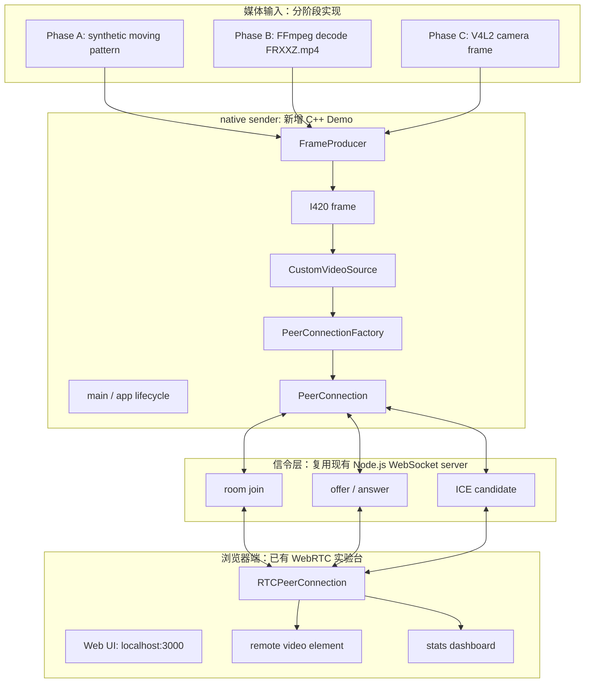
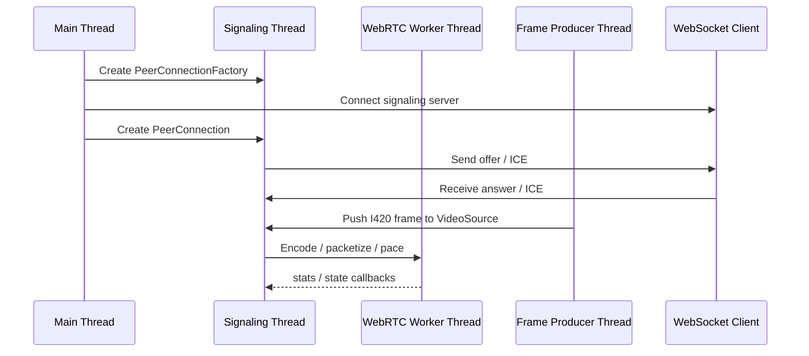
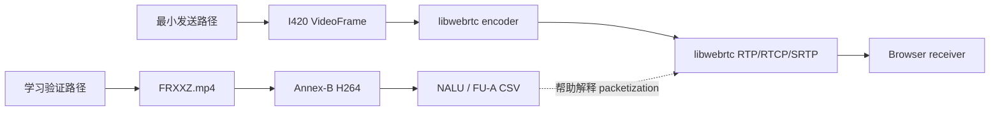

# Native libwebrtc Sender 最小 Demo 设计图

## 1. 这一步的定位

前面已经完成了三类能力：

1. 浏览器 WebRTC MVP：验证 PeerConnection、SDP、ICE、DataChannel、stats。
2. native 采集和媒体分析：V4L2 摄像头采集、FFmpeg packet / PTS / DTS / GOP 分析。
3. H.264 链路实验：AVCC -> Annex-B、NALU 解析、RTP single NALU / FU-A 分片。

现在进入 native libwebrtc sender 前，需要先明确一个关键取舍：

**最小可落地 Demo 优先走 Raw Frame -> libwebrtc 编码 -> RTP/RTCP，而不是自己生成 RTP 包后塞进 libwebrtc。**

原因是 libwebrtc 的核心价值不只是 RTP 打包，还包括 ICE、DTLS-SRTP、RTCP、NACK/PLI、拥塞控制、pacing、编码器适配和 stats。我们自己写的 RTP packetizer 是学习和解释模块，不应该替代 libwebrtc 内部传输栈。

参考资料：

- WebRTC Native APIs: https://webrtc.github.io/webrtc-org/native-code/native-apis/
- WebRTC development and native examples: https://webrtc.github.io/webrtc-org/native-code/development/
- `PeerConnectionFactoryInterface` / `PeerConnectionInterface`: https://webrtc.googlesource.com/src/+/refs/heads/main/api/peer_connection_interface.h
- native peerconnection example: https://webrtc.googlesource.com/src/+/refs/heads/main/examples/peerconnection/client/

## 2. 最小 Demo 总体目标

实现一个 native C++ sender，向当前浏览器页面发送视频流。浏览器端继续使用已有 `http://localhost:3000/` 页面和 WebSocket signaling server。

第一版目标：

1. native 端创建 `PeerConnectionFactory`。
2. native 端创建 `PeerConnection`。
3. native 端通过 WebSocket 或 HTTP/WebSocket 辅助信令与浏览器交换 SDP / ICE。
4. native 端提供一个视频源。
5. 浏览器端作为 receiver 显示 native 发来的视频。
6. 浏览器 stats 面板能观察 inbound-rtp 指标。

第一版不追求：

1. 双向音视频通话。
2. 自定义 SRTP / DTLS。
3. 自己接管 RTP socket。
4. 接入硬编。
5. 完整产品级异常恢复。

## 3. 完整链路设计图



## 4. 为什么第一版用 synthetic frame

虽然项目最终想接摄像头或素材，但 native libwebrtc 第一版建议先用 synthetic moving pattern，例如移动色块、帧号水印、时间戳条纹。

这样做的价值：

1. 避免一开始同时调 libwebrtc、FFmpeg、V4L2、像素格式转换、信令五个变量。
2. 可以稳定生成 I420 帧，便于定位问题。
3. 浏览器看到画面后，再替换为 FFmpeg decode 或 V4L2 输入。
4. 面试时体现“复杂系统先最小闭环，再逐步替换输入源”的工程方法。

后续替换输入源时，整体 sender 架构不变，只替换 `FrameProducer`。

## 5. native 模块规划

建议新增目录：

```text
native/libwebrtc_sender/
  CMakeLists.txt
  README.md
  main.cpp
  signaling_client.h
  signaling_client.cpp
  peer_connection_app.h
  peer_connection_app.cpp
  custom_video_source.h
  custom_video_source.cpp
  synthetic_frame_producer.h
  synthetic_frame_producer.cpp
  frame_clock.h
  frame_clock.cpp
```

职责说明：

- `main`：解析参数、启动线程、处理退出。
- `signaling_client`：连接已有 Node.js WebSocket server，收发 JSON 信令。
- `peer_connection_app`：封装 PeerConnectionFactory、PeerConnection、offer/answer、ICE candidate、track 创建。
- `custom_video_source`：把 native 生成的帧推给 libwebrtc video track。
- `synthetic_frame_producer`：生成 I420 测试帧。
- `frame_clock`：按 fps 输出单调递增 timestamp。

## 6. 信令复用设计

已有浏览器 MVP 的 server 负责房间和 WebSocket 消息转发。native sender 需要遵守同一套信令协议。

推荐新增角色字段：

```json
{
  "type": "join",
  "room": "native-demo",
  "role": "native-sender"
}
```

SDP 和 ICE 继续复用：

```json
{
  "type": "offer",
  "room": "native-demo",
  "sdp": "..."
}
```

```json
{
  "type": "candidate",
  "room": "native-demo",
  "candidate": {
    "candidate": "candidate:...",
    "sdpMid": "0",
    "sdpMLineIndex": 0
  }
}
```

## 7. 线程模型

WebRTC Native APIs 文档说明 native PeerConnection API 涉及 signaling thread 和 worker thread；callbacks 通常在 signaling thread 上触发，耗时任务不应该阻塞 signaling thread。

Demo 中建议：



关键原则：

1. PeerConnection callbacks 中只做轻量状态更新。
2. 帧生产单独线程控制 fps。
3. 信令 IO 不阻塞 libwebrtc callback。
4. 退出时按顺序停止 frame producer、关闭 PeerConnection、断开 signaling。

## 8. 媒体输入分三阶段

### Phase A：Synthetic I420

```text
Synthetic pattern
  -> I420Buffer
  -> VideoFrame
  -> CustomVideoSource
  -> libwebrtc encoder
```

验收：浏览器能看到 native 发送的动态图案。

### Phase B：FFmpeg Decode FRXXZ.mp4

```text
FRXXZ.mp4
  -> avformat / avcodec decode
  -> swscale to I420
  -> VideoFrame
  -> libwebrtc encoder
```

验收：浏览器能看到指定素材播放。这里可以复用前面 FFmpeg probe 对 time_base、PTS、帧顺序的理解。

### Phase C：V4L2 Camera

```text
/dev/video0
  -> V4L2 MJPEG/YUYV
  -> decode/convert to I420
  -> VideoFrame
  -> libwebrtc encoder
```

验收：浏览器能看到 WSL 摄像头画面。如果 WSL USB/IP 不稳定，保留 synthetic 和 FFmpeg 素材作为稳定演示路径。

## 9. 与 H.264 RTP packetizer 的关系

前一步 `h264_rtp_packetizer` 不直接接入 native sender 的主路径，它的作用是解释和验证 libwebrtc 内部会做的事情。

关系如下：



面试表达：

> 我没有绕开 libwebrtc 自己发 RTP，因为那样会丢掉 WebRTC 真正复杂且有价值的部分，比如 SRTP、RTCP feedback、NACK/PLI、拥塞控制和 pacing。但我单独实现了 H.264 RTP packetizer，用来证明我理解 libwebrtc 内部媒体包化的基本原理。

## 10. 构建策略

libwebrtc 构建成本高，不能和当前小型 CMake 工程等量看待。

建议分两步：

1. `docs + adapter layer`：先把接口设计、信令兼容和模块边界确定。
2. `external libwebrtc checkout`：在 `third_party/webrtc` 或 workspace 外部独立拉取和构建，再将 native sender 作为示例应用接入。

不要把完整 WebRTC 源码直接提交进当前项目目录。

## 11. 验收标准

最小 Demo 完成的标准：

1. native sender 可以加入房间。
2. 浏览器端可以收到 offer/answer/ICE。
3. 浏览器 remote video 出现 native 发送的动态图案。
4. 浏览器 stats 可以看到 inbound-rtp video。
5. 文档记录 build 成本、API 选择、线程模型、遇到的问题。

## 12. 风险和备用方案

| 风险 | 影响 | 备用方案 |
| --- | --- | --- |
| libwebrtc checkout 大、构建慢 | 实现周期拉长 | 先完成接口骨架和信令适配文档 |
| WSL 摄像头不稳定 | native camera sender 演示不稳定 | 先用 synthetic frame 和 FRXXZ.mp4 |
| native WebSocket 依赖选择 | 引入额外依赖 | 第一版可用 stdin/stdout 手动信令或小型 websocketpp |
| H.264 encoded injection API 不稳定 | 走不通 encoded path | 第一版走 raw frame，让 libwebrtc 编码 |
| 浏览器 codec 协商不一致 | 收不到画面 | 第一版不强制 H.264，先用 libwebrtc 默认 VP8/H.264 能力跑通 |

## 13. 下一步执行建议

进入实现前，建议先做一个更小的前置任务：

1. 检查本机是否已有 libwebrtc checkout 或系统包。
2. 如果没有，评估 depot_tools / fetch webrtc 的网络和磁盘成本。
3. 给当前浏览器 signaling server 增加 native role 兼容说明。
4. 再决定是直接编译官方 peerconnection_client，还是新建 `native/libwebrtc_sender`。

推荐路线：

```text 
先跑官方 peerconnection_client/server
  -> 理清编译环境
  -> 新建最小 native sender
  -> synthetic frame 成功显示到浏览器
  -> 替换为 FRXXZ.mp4 解码帧
  -> 最后尝试 V4L2 摄像头帧
```
