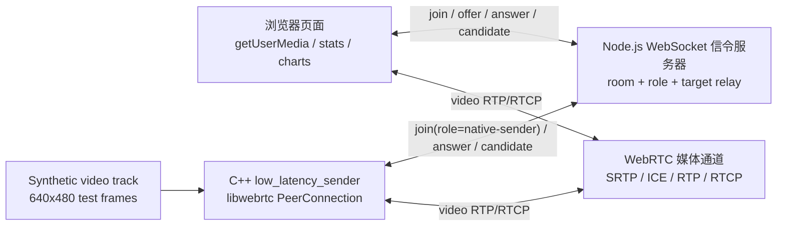

# Native low_latency_sender 实现说明

## 目标

这一阶段的目标不是直接做一个完整 SFU，也不是一上来接真实摄像头，而是先完成一个可以面试讲清楚的最小 native libwebrtc sender：

- 原生 C++ 进程使用官方 libwebrtc 创建 PeerConnection。
- 原生进程通过项目自带 WebSocket 信令服务器加入浏览器房间。
- 浏览器作为 offerer，native sender 作为 answerer。
- native sender 先发送 synthetic video track，后续再替换成 V4L2/FFmpeg/编码器输入。

这样可以先把最难的“native PeerConnection 生命周期 + SDP/ICE 信令 + 浏览器互通”跑起来，再逐步接入真正的视频采集和编码链路。

## 当前架构



## 代码位置

- 项目源码：`native/libwebrtc_sender/`
- 同步脚本：`scripts/sync_low_latency_sender_to_webrtc.sh`
- WebRTC checkout 目标：`third_party/webrtc-checkout/src/examples/low_latency_sender/`
- 生成的二进制：`third_party/webrtc-checkout/src/out/Default/low_latency_sender`

## 信令协议变化

为了支持 native sender 先启动或后启动，本次给 join 消息增加了 `role`：

```json
{ "type": "join", "room": "lab", "role": "native-sender" }
```

server 会在 `joined.peers` 和 `peer-joined` 中带上 role。浏览器如果发现已有 peer 是 `native-sender`，会主动向它发送定向 offer；如果 native 后加入，浏览器也会在 `peer-joined` 后向该 peer 发 offer。

## 构建方式

```bash
cd /home/bfm01000/workspace/learnffmpeg/project/14_WebRTC_Interview_Project
scripts/sync_low_latency_sender_to_webrtc.sh
source scripts/use_webrtc_proxy.sh
cd third_party/webrtc-checkout/src
gn gen out/Default --args='is_debug=true rtc_include_tests=false treat_warnings_as_errors=false rtc_include_pulse_audio=false'
autoninja -C out/Default examples/low_latency_sender:low_latency_sender
```

关闭 `rtc_include_pulse_audio=false` 是 WSL 环境下的关键修复。默认 PulseAudio 路径会在音频设备初始化时触发 thread checker fatal；当前项目第一版只需要视频，所以先禁用 PulseAudio，让 WebRTC 回落到 ALSA 路径并保持进程稳定。

## 运行方式

先启动页面 server：

```bash
cd /home/bfm01000/workspace/learnffmpeg/project/14_WebRTC_Interview_Project
node server.js
```

再启动 native sender：

```bash
cd /home/bfm01000/workspace/learnffmpeg/project/14_WebRTC_Interview_Project/third_party/webrtc-checkout/src
./out/Default/low_latency_sender --host 127.0.0.1 --port 3000 --room lab
```

然后打开 `http://localhost:3000`，房间保持默认 `lab`，点击 Join。Remote Video 区域应该显示 native sender 发过来的测试画面。

## 已验证

- `gn gen` 成功，参数包含 `rtc_include_pulse_audio=false`。
- `autoninja -C out/Default examples/low_latency_sender:low_latency_sender` 成功。
- `low_latency_sender --help` 输出默认房间 `lab`。
- server 监听 `0.0.0.0:3000`。
- native sender 与 server 建立了 `127.0.0.1:3000` TCP ESTABLISHED 连接。

## 下一步

- 用浏览器手动刷新页面并加入 `lab`，确认 remote video 能看到 synthetic track。
- 如果画面建立成功，开始把 synthetic video source 替换为真实输入：先接 V4L2 摄像头，再接 FFmpeg 解码帧，最后再考虑硬编码/H264 pipeline。
- 给 native sender 增加更清晰的日志刷新，避免后台运行时 stdout 缓冲导致状态不可见。