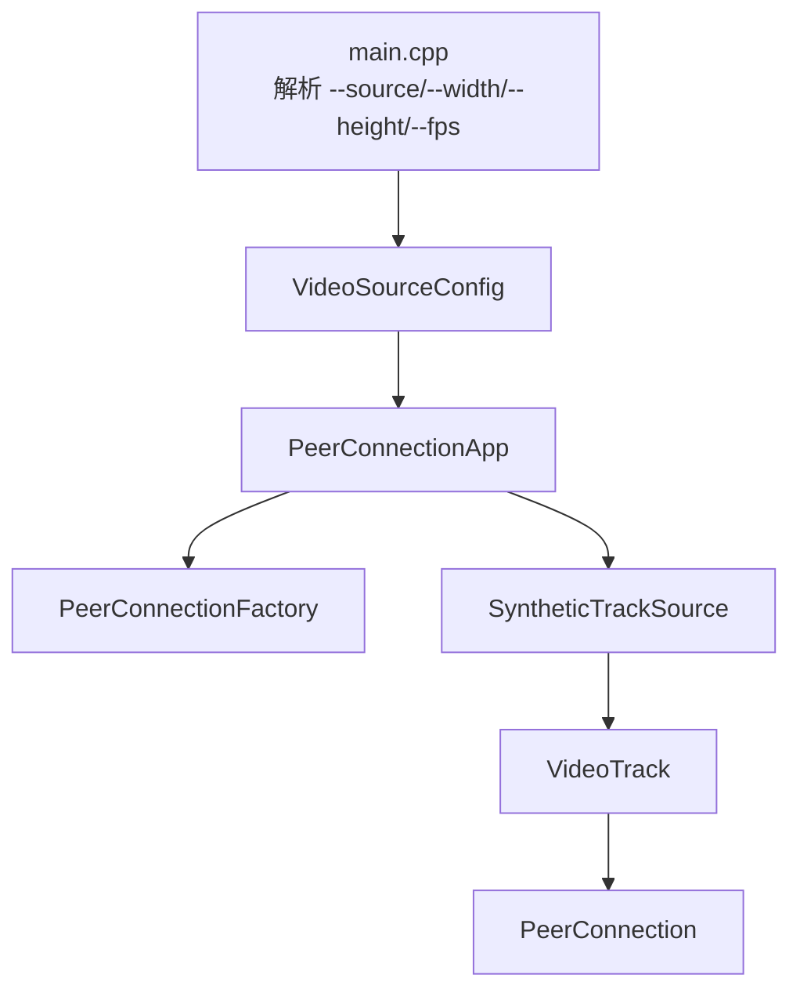

# Native sender 视频源参数化

## 目标

上一版 native sender 已经能创建 libwebrtc PeerConnection，并发送固定的 synthetic video track。本次把视频源参数从代码里抽出来，变成命令行配置：

- `--source synthetic`
- `--width 640`
- `--height 480`
- `--fps 30`

这一步的意义是把 WebRTC 主流程和视频输入源解耦。后续接 V4L2 摄像头、FFmpeg 解码帧或硬编码输入时，只需要新增 source 实现，而不需要重写 PeerConnection、SDP/ICE、信令和 AddTrack 流程。

## 新的运行方式

```bash
cd /home/bfm01000/workspace/learnffmpeg/project/14_WebRTC_Interview_Project/third_party/webrtc-checkout/src
./out/Default/low_latency_sender \
  --host 127.0.0.1 \
  --port 3000 \
  --room lab \
  --source synthetic \
  --width 320 \
  --height 240 \
  --fps 15
```

页面端打开 `http://localhost:3000`，房间保持 `lab`，点击 Join。

## 当前代码结构



## 已验证

- `autoninja -C out/Default examples/low_latency_sender:low_latency_sender` 编译通过。
- `low_latency_sender --help` 已显示新参数。
- 使用 `--width 320 --height 240 --fps 15` 启动成功。
- 日志显示：`Synthetic video track added: 320x240@15fps`。
- native sender 已加入 `lab` 房间，并和 Node server 建立 TCP 连接。

## 面试讲法

这一版可以强调“我没有把采集源写死在 WebRTC 逻辑里，而是先抽象出 `VideoSourceConfig`”。PeerConnection 只关心拿到一个 `VideoTrackSourceInterface`，具体帧来自 synthetic、V4L2 还是 FFmpeg，是下一层输入模块的责任。这个设计让项目从 demo 更接近真实工程：信令、PeerConnection 生命周期、媒体源、后续编码/采集模块边界清晰。

## 下一步

下一步开始实现真正输入源的第一版：优先接 WSL 已经验证过的 `/dev/video0`，做一个 V4L2 camera source。路径建议是先采集 MJPEG/JPEG 帧并转成 WebRTC 可吃的 I420/VideoFrame，再推给 `VideoTrackSourceInterface`。