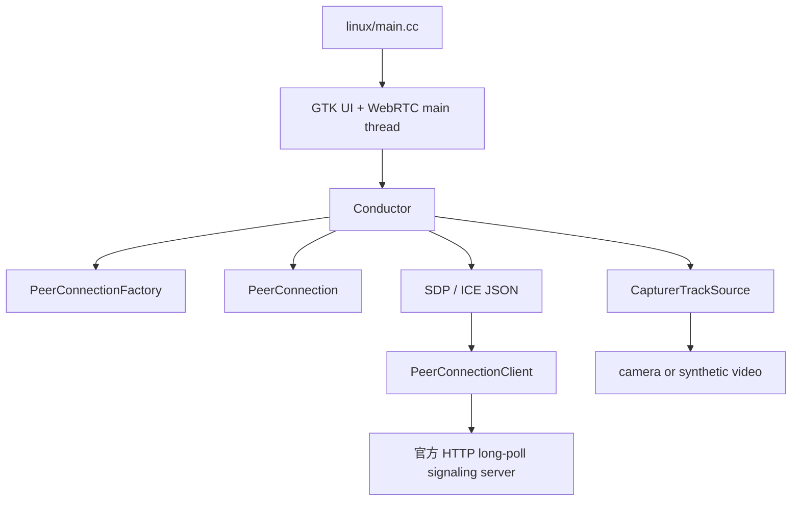
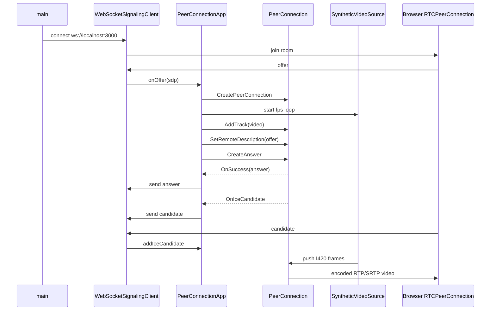

# 官方 peerconnection_client 示例拆解

## 目标

这份文档用于把 WebRTC 官方 `examples/peerconnection/client` 示例拆成可复用的工程知识，服务于本项目后续 `native/libwebrtc_sender` 最小 Demo。

官方示例路径：

```text
/home/bfm01000/workspace/third_party/webrtc-checkout/src/examples/peerconnection/client
```

重点文件：

```text
conductor.h
conductor.cc
peer_connection_client.h
peer_connection_client.cc
linux/main.cc
linux/main_wnd.cc
```

## 官方示例的职责拆分



### `linux/main.cc`

负责：

1. 初始化 GTK。
2. 创建 `webrtc::Environment`。
3. 创建带 socket server 的 WebRTC 主线程。
4. 初始化 SSL。
5. 创建 `PeerConnectionClient`、`Conductor` 和 GTK window。
6. 启动主线程事件循环。

我们可以借鉴：

- `webrtc::CreateEnvironment(...)`
- `webrtc::InitializeSSL()` / `webrtc::CleanupSSL()`
- `webrtc::ThreadManager::Instance()->SetCurrentThread(...)`

不建议照搬：

- GTK UI。
- 把 UI event loop 和 socket server 混在一起的 `CustomSocketServer`。

本项目第一版 native sender 应该做 headless CLI，不需要 GTK。

### `Conductor`

`Conductor` 是官方示例最有价值的部分。它承担 PeerConnection 生命周期管理：

1. 创建 signaling thread。
2. 创建 `PeerConnectionFactory`。
3. 创建 `PeerConnection`。
4. 创建并添加 audio/video track。
5. 处理 remote SDP。
6. 创建 offer/answer。
7. 处理 ICE candidate。
8. 发送本地 SDP/ICE 到信令层。
9. 清理 PeerConnection 和本地 video source。

我们应该重点借鉴：

- `InitializePeerConnection()`
- `CreatePeerConnection()`
- `AddTracks()`
- `OnMessageFromPeer()` 中 SDP/ICE 的解析和处理逻辑
- `OnIceCandidate()` 中 candidate 序列化逻辑
- `OnSuccess()` 中 local description 设置和 SDP 发送逻辑

不建议照搬：

- `MainWndCallback` / UI 回调。
- `pending_messages_` 依赖 UI thread callback 的发送队列。
- 官方 loopback 逻辑。
- audio track，第一版 native sender 可以先只发视频。

### `CapturerTrackSource`

官方示例里 `CapturerTrackSource` 继承 `webrtc::VideoTrackSource`：

```text
CapturerTrackSource
  -> TestVideoCapturer
  -> camera or FrameGeneratorCapturer
  -> VideoTrackSourceInterface
```

如果没有摄像头，它会 fallback 到 synthetic square frame generator。

这点非常适合我们第一版：

```text
synthetic frame
  -> VideoTrackSource
  -> CreateVideoTrack
  -> AddTrack
```

区别是：官方 synthetic capturer 来自 `test/` 模块，适合示例，但我们项目最终应实现自己的 `SyntheticVideoSource` 或 `SyntheticFrameProducer`，减少对 test helper 的依赖。

### `PeerConnectionClient`

这是官方示例自带的信令 client，但它不是 WebSocket，而是配套 `peerconnection_server` 的 HTTP 长轮询协议。

它负责：

1. `/sign_in` 登录。
2. `/wait` 长轮询等待 peer 消息。
3. `/message` 发送 SDP/ICE。
4. `/sign_out` 退出。
5. 维护 peer list。

本项目不建议复用它。

原因：

- 我们已有 Node.js WebSocket signaling server。
- 浏览器 MVP 已经使用 `join / offer / answer / candidate` JSON 消息。
- 复用官方 HTTP signaling 会变成两套协议，反而增加面试解释成本。

## 对本项目的结论

本项目 native sender 应该重写三块：

1. Headless main，不使用 GTK。
2. WebSocket signaling client，对接现有 `server.js`。
3. Synthetic video source，第一版只生成 I420 测试帧。

可以借鉴三块：

1. `PeerConnectionFactoryDependencies` 的创建方式。
2. `PeerConnectionInterface::RTCConfiguration` 和 `CreatePeerConnectionOrError`。
3. SDP/ICE 的 WebRTC API 调用流程。

## 最小调用链



## 第一版角色选择

推荐浏览器先加入房间并发 offer，native sender 后加入并作为 answerer。

原因：

1. 当前浏览器页面收到 `peer-joined` 会主动 `makeOffer()`。
2. native 作为 answerer 可以避免第一版处理 glare。
3. `server.js` 和 `public/app.js` 暂时不需要修改。

## 后续实现前的注意点

1. 不能直接在本项目 CMake 里链接 WebRTC；WebRTC 使用 GN/Ninja 构建，第一版建议把 sender 放到 WebRTC checkout 的 `src/examples` 或新增 GN target。
2. 本项目目录保存设计、脚本、源码草稿；实际编译目标可以先放在 WebRTC checkout 里，避免跨构建系统链接复杂度。
3. 第一版只发视频，音频和 DataChannel 之后再加。
4. 第一版不强制 H.264，先用 libwebrtc 默认 codec 跑通；成功后再研究 SDP codec preference 或 H.264 encoder factory。