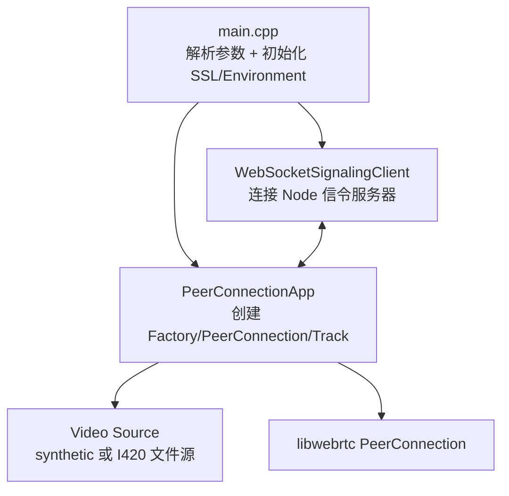
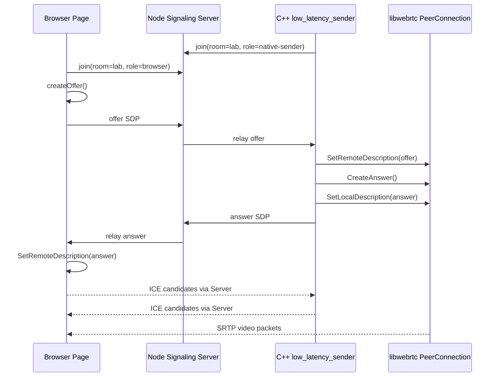

# 从零理解 native sender：PeerConnection 从哪里来，视频是怎么发到浏览器的

这篇文档专门解释当前项目里的 native WebRTC 发送链路。目标不是背 API，而是让你能讲清楚：`PeerConnection` 是什么、来自哪里、我们自己写了什么、libwebrtc 帮我们做了什么、`FRXXZ.mp4` 的画面最后为什么能出现在浏览器里。

## 先给一句话版本

当前项目做的是：

```text
C++ 程序 low_latency_sender
读取 FRXXZ.mp4 解码出来的 I420 视频帧
把每一帧包装成 WebRTC VideoFrame
塞进 libwebrtc 的 VideoTrack
再通过 libwebrtc 的 PeerConnection 发给浏览器页面
```

你可以把它理解成：

```text
我们负责准备视频帧 + 做信令 + 调 libwebrtc API
libwebrtc 负责真正的 WebRTC 协议栈和音视频传输
浏览器负责接收远端 track 并显示到 video 标签
```

## 1. PeerConnection 是什么

`PeerConnection` 是 WebRTC 里最核心的对象。它不是一个简单 socket，也不是一个播放器，而是一个“实时音视频连接管理器”。

它里面负责很多事情：

```text
SDP 协商
ICE 打洞
DTLS 握手
SRTP 加密传输
RTP/RTCP 收发
音视频编码器调度
拥塞控制
NACK/PLI/FIR 等弱网恢复机制
带宽估计
```

所以面试里不要说“我自己实现了 WebRTC”。更准确的说法是：

> 我基于 Google 官方 libwebrtc 的 `PeerConnectionInterface` 实现了一个 native sender。我的工作是把本地视频帧接入 `VideoTrack`，并通过 WebSocket 信令和浏览器交换 SDP/ICE，让 libwebrtc 完成真正的实时传输。

## 2. PeerConnection 来自哪里

它来自 Google 官方 libwebrtc。

当前项目里不是直接 `new PeerConnection`，而是先创建一个工厂：

```cpp
factory_ = webrtc::CreateModularPeerConnectionFactory(std::move(deps));
```

然后通过工厂创建 PeerConnection：

```cpp
auto result = factory_->CreatePeerConnectionOrError(config, std::move(deps));
peer_ = std::move(result.value());
```

代码位置：

- `native/libwebrtc_sender/peer_connection_app.cpp`
- `PeerConnectionApp::Initialize()` 创建 factory
- `PeerConnectionApp::CreatePeerConnection()` 创建 PeerConnection

关系是：

```text
libwebrtc
  -> PeerConnectionFactory
    -> CreatePeerConnectionOrError()
      -> PeerConnectionInterface
        -> peer_
```

## 3. 为什么要先创建 PeerConnectionFactory

`PeerConnectionFactory` 可以理解为“WebRTC 对象工厂”。

它创建 PeerConnection 之前，需要知道：

```text
用哪个线程跑信令
用哪些音频编码器/解码器
用哪些视频编码器/解码器
是否启用 media engine
当前 WebRTC environment 是什么
```

项目里对应代码是：

```cpp
webrtc::PeerConnectionFactoryDependencies deps;
deps.signaling_thread = signaling_thread_.get();
deps.env = env_;
deps.audio_encoder_factory = webrtc::CreateBuiltinAudioEncoderFactory();
deps.audio_decoder_factory = webrtc::CreateBuiltinAudioDecoderFactory();
deps.video_encoder_factory = ...;
deps.video_decoder_factory = ...;
webrtc::EnableMedia(deps);
factory_ = webrtc::CreateModularPeerConnectionFactory(std::move(deps));
```

这一步的意思是：我告诉 libwebrtc，“你创建 PeerConnection 时，可以使用这些线程和编码器能力”。

## 4. 我们自己写的 C++ 程序分几层

当前 native sender 大致分 4 层：



每层职责不同：

```text
main.cpp
  负责解析命令行参数，比如 --source i420 --file xxx --width 320 --height 180 --fps 25

WebSocketSignalingClient
  负责连 Node.js WebSocket 信令服务器，收发 JSON 消息

PeerConnectionApp
  负责创建 PeerConnection，添加 VideoTrack，处理 offer/answer/candidate

Video Source
  负责产生一帧一帧的视频数据

libwebrtc PeerConnection
  负责真正的 WebRTC 传输
```

## 5. 当前视频源有两种

当前 `low_latency_sender` 支持两种 source：

```text
--source synthetic
  使用 libwebrtc 测试帧生成器，生成方块测试图

--source i420 --file xxx.i420
  读取 FRXXZ.mp4 解码后的 I420 raw 文件，按 fps 推给 WebRTC
```

也就是说，最开始我们用 synthetic 是为了先证明 PeerConnection 跑得通；现在 I420 source 是为了证明真实视频素材能进入 native WebRTC 发送链路。

## 6. FRXXZ.mp4 是怎么变成 WebRTC 帧的

这里分两步。

第一步：离线解码。

```text
FRXXZ.mp4
  -> FFmpeg 解封装
  -> H.264 解码
  -> sws_scale 转成 I420
  -> artifacts/frxxz-320x180-200f.i420
```

工具是：

```text
native/video_file_decode
```

第二步：native sender 读取 I420。

```text
frxxz-320x180-200f.i420
  -> I420FileTrackSource 读取每帧
  -> I420Buffer::Copy
  -> VideoFrame::Builder
  -> VideoBroadcaster::OnFrame
  -> VideoTrack
  -> PeerConnection
```

I420 每帧大小计算方式是：

```text
width * height * 3 / 2
```

以 320x180 为例：

```text
320 * 180 * 3 / 2 = 86400 bytes
```

所以 sender 每次从文件读 86400 字节，就是一帧画面。

## 7. I420 是什么，为什么用它

I420 是一种 YUV420P 像素格式，由 3 个平面组成：

```text
Y 平面：亮度，大小 width * height
U 平面：色度，大小 width/2 * height/2
V 平面：色度，大小 width/2 * height/2
```

总大小就是：

```text
Y + U + V
= width*height + width*height/4 + width*height/4
= width*height*3/2
```

WebRTC 内部非常常见地使用 I420 作为软件视频帧输入格式。我们用 I420 的原因是：

```text
格式简单
没有容器和压缩编码干扰
容易计算每帧大小
容易转换成 webrtc::I420Buffer
适合作为 FFmpeg/V4L2/文件源到 WebRTC 的中间格式
```

## 8. VideoTrack 是什么

`VideoTrack` 可以理解成一条“视频轨道”。

浏览器里你可能见过：

```js
stream.getVideoTracks()
```

native libwebrtc 里也有类似概念。我们创建一个视频源，再创建一个 video track：

```cpp
auto video_track = factory_->CreateVideoTrack(video_source_, kVideoLabel);
peer_->AddTrack(video_track, {kStreamId});
```

这句 `AddTrack` 的意思是：

> 我要通过这个 PeerConnection 发送这条视频轨道。

但注意：`AddTrack` 只是把“轨道”挂到 PeerConnection 上。真正的帧还要由 `video_source_` 一帧一帧推出来。

## 9. I420FileTrackSource 是怎么推帧的

我们实现了一个 `I420FileTrackSource`。

它做的事情是：

```text
打开 .i420 文件
计算每帧大小
启动一个后台线程
每隔 1/fps 秒读取一帧
把 raw I420 数据复制到 webrtc::I420Buffer
构造 webrtc::VideoFrame
调用 VideoBroadcaster::OnFrame(frame)
文件读完后回到开头循环播放
```

核心概念是：

```text
I420 文件只是原始字节
I420Buffer 是 WebRTC 能理解的像素 buffer
VideoFrame 是 WebRTC 能理解的一帧视频
VideoBroadcaster 是把 frame 分发给 VideoTrack 的桥
```

可以理解成：

```text
磁盘上的 raw frame
  -> WebRTC buffer
    -> WebRTC frame
      -> WebRTC track
        -> PeerConnection 发送
```

## 10. 信令服务器是干什么的

WebRTC 两端不能凭空连上。它们需要先交换信息：

```text
我支持什么编码格式
我要发送几条音视频轨道
我的网络候选地址有哪些
加密握手需要什么参数
```

这些信息主要通过 SDP 和 ICE candidate 交换。

我们的项目用了一个 Node.js WebSocket server 做信令。

它不传视频，只传 JSON 控制消息：

```text
join
peer-joined
offer
answer
candidate
peer-left
```

所以要分清：

```text
信令服务器：只负责牵线，传 SDP/ICE JSON
PeerConnection：负责真正音视频传输
```

## 11. offer/answer 是怎么走的

当前设计里，浏览器一般是 offerer，native sender 是 answerer。

流程是：



对应 native 代码：

```cpp
HandleOffer(message);
peer_->SetRemoteDescription(...);
peer_->CreateAnswer(...);
```

answer 创建成功后：

```cpp
peer_->SetLocalDescription(...);
send_(answer_json);
```

## 12. ICE candidate 是什么

ICE candidate 可以理解成“我这边可能能连通的网络地址”。

比如：

```text
本机局域网地址
NAT 后的地址
通过 STUN 探测出的地址
通过 TURN 中继的地址
```

PeerConnection 会自动收集 candidate。收集到之后，会回调我们：

```cpp
void PeerConnectionApp::OnIceCandidate(const webrtc::IceCandidate* candidate)
```

我们把 candidate 转成 JSON，通过 WebSocket 发给浏览器。

浏览器也会把它的 candidate 发给 native。native 收到后调用：

```cpp
peer_->AddIceCandidate(candidate.get())
```

这一来一回之后，libwebrtc 才能找到真正可用的网络路径。

## 13. 视频数据是不是通过 WebSocket 发的

不是。

这是一个很重要的点。

```text
WebSocket 只传信令：offer/answer/candidate
视频数据不走 WebSocket
视频数据走 PeerConnection 里的 RTP/SRTP 通道
```

所以真正的视频路径是：

```text
I420FileTrackSource
  -> VideoTrack
  -> PeerConnection
  -> RTP/SRTP
  -> Browser PeerConnection
  -> remote video tag
```

## 14. 浏览器为什么能看到画面

浏览器页面创建自己的 `RTCPeerConnection`，收到 native answer 后连接建立。只要 native 通过 `VideoTrack` 发出帧，浏览器端就会触发：

```js
peer.ontrack = (event) => {
  const [remoteStream] = event.streams;
  remoteVideo.srcObject = remoteStream;
};
```

也就是说：

```text
native AddTrack
  -> SDP 里声明有 video track
  -> 浏览器协商成功
  -> RTP 视频包到达浏览器
  -> 浏览器组装成 MediaStreamTrack
  -> ontrack 回调
  -> video 标签播放
```

## 15. 当前项目已经做到哪里

目前已经完成：

```text
浏览器 WebRTC 页面
Node.js WebSocket 信令服务器
libwebrtc checkout/build
C++ low_latency_sender
synthetic 视频源
FRXXZ.mp4 解码到 I420
I420 文件源接入 low_latency_sender
native sender 加入 lab 房间并持续推帧
```

当前正在跑的 sender 类似这个命令：

```bash
./out/Default/low_latency_sender \
  --host 127.0.0.1 \
  --port 3000 \
  --room lab \
  --source i420 \
  --file /home/bfm01000/workspace/learnffmpeg/project/14_WebRTC_Interview_Project/artifacts/frxxz-320x180-200f.i420 \
  --width 320 \
  --height 180 \
  --fps 25
```

日志里看到：

```text
I420 file source started
joined room: lab
i420 frames sent: 3625
```

这说明 native sender 正在不断把 FRXXZ 的 I420 帧推给 WebRTC。

## 16. 我们自己写了什么，libwebrtc 做了什么

我们自己写的：

```text
WebSocket 信令 client
Node.js 信令 server
PeerConnectionApp 封装
I420 文件读取和循环推帧
FFmpeg 解码工具
页面 stats 和远端播放 UI
```

libwebrtc 做的：

```text
PeerConnectionFactory
PeerConnection
VideoTrack
编码器调用
RTP/RTCP
ICE
DTLS
SRTP
拥塞控制
丢包恢复
WebRTC 状态机
```

浏览器做的：

```text
创建浏览器侧 PeerConnection
发 offer
收 answer
收 native video track
解码并渲染到 video 标签
提供 getStats 数据
```

## 17. 面试时怎么讲这个项目

你可以这样讲：

> 这个项目我做了一个 native C++ WebRTC sender。浏览器端是一个调试页面，C++ 端基于 Google libwebrtc 创建 PeerConnection。信令层我用 Node.js WebSocket 自己实现，只负责转发 join、offer、answer 和 ICE candidate。媒体层我先用 FFmpeg 把 MP4 解码成 I420，再在 native sender 里读取 I420 帧，构造 `webrtc::I420Buffer` 和 `webrtc::VideoFrame`，通过 `VideoBroadcaster` 推给 `VideoTrack`，最后由 PeerConnection 通过 RTP/SRTP 发给浏览器。这样我能把编解码、像素格式、WebRTC 协商和实时传输串起来。

如果面试官问：为什么不直接发 MP4？

你可以说：

> WebRTC 不是文件传输协议，PeerConnection 发送的是实时媒体轨道。MP4 是容器，里面有压缩后的 H.264 packet；要走 WebRTC track，通常需要变成一帧一帧的媒体数据，或者接入编码器输出。当前我先走 I420 raw frame，是为了把“媒体文件解码”和“WebRTC 发送”拆开验证。后续可以继续演进成实时 FFmpeg decoder source，或者直接推 H.264 encoded frame。

如果面试官问：PeerConnection 是你写的吗？

你可以说：

> 不是，PeerConnection 来自 Google libwebrtc。我写的是 native sender 的 glue code：创建 PeerConnectionFactory，配置 encoder/decoder factory，创建 PeerConnection，添加视频 track，实现信令收发，并把本地视频帧推入 WebRTC source。

如果面试官问：WebSocket 传视频吗？

你可以说：

> 不传。WebSocket 只负责信令，传 SDP 和 ICE candidate。真正的视频数据走 PeerConnection 建立出来的 RTP/SRTP 媒体通道。

## 18. 你现在应该怎么验证

1. 确认 server 和 native sender 在跑。
2. 打开 `http://localhost:3000`。
3. 房间保持 `lab`。
4. 点击 `Join`。
5. 看 `Remote Video` 是否出现 FRXXZ 画面。
6. 看 stats 里的 inbound fps、resolution、recv bitrate 是否有数据。

## 19. 下一步建议

先不要急着继续加功能。下一步最好做验证和整理：

```text
确认浏览器能看到 FRXXZ 画面
确认 stats 能显示接收码率/fps/resolution
把 I420FileTrackSource 从 peer_connection_app.cpp 拆成单独文件
增加 source 状态日志：source 类型、帧数、循环次数
再考虑实时 FFmpeg decoder source 或 V4L2 camera source
```

这样项目就会从“能跑”变成“能讲清楚、能维护、能扩展”。