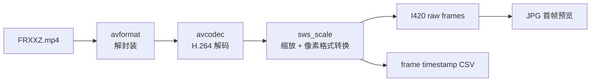

# 视频文件源接入前置：MP4 解码到 I420

## 目标

本项目后续要让 native libwebrtc sender 发送真实视频素材。为了避免把“FFmpeg 解码问题”和“WebRTC PeerConnection 问题”混在一起，本次先做一个独立工具：把统一素材 `FRXXZ.mp4` 解码并转换成 WebRTC 容易接入的 I420 帧。

## 新增模块

- `native/video_file_decode/main.cpp`
- `native/video_file_decode/CMakeLists.txt`
- `native/video_file_decode/README.md`

## 数据流



## 验证命令

```bash
cd /home/bfm01000/workspace/learnffmpeg/project/14_WebRTC_Interview_Project
native/build/video_file_decode/video_file_decode \
  --input /home/bfm01000/workspace/video_downloads/FRXXZ.mp4 \
  --frames 10 \
  --width 320 \
  --height 180 \
  --output /tmp/frxxz-320x180-10f.i420 \
  --csv /tmp/frxxz-320x180-10f.csv
```

## 验证结果

```text
input      : /home/bfm01000/workspace/video_downloads/FRXXZ.mp4
codec      : h264
source     : 852x480 pix_fmt=yuv420p
i420       : 320x180, 86400 bytes/frame
frames     : 10
```

CSV 时间戳显示前 10 帧为 0.000、0.040、0.080 ... 秒，说明素材是 25fps 节奏。

首帧预览图：`artifacts/frxxz-first-frame.jpg`。

## 面试讲法

这一节可以讲“我把媒体输入链路拆出来单独验证”。WebRTC 发送不是只会调 API，还要处理真实媒体数据的格式、时间戳和节奏。这里先用 FFmpeg 把 MP4 解封装、H.264 解码，然后统一转成 I420。I420 是 WebRTC 视频源非常常见的输入格式，后续可以包装成 `webrtc::I420Buffer` 和 `webrtc::VideoFrame`，再由自定义 track source 按 25fps 节奏推给 PeerConnection。

## 下一步

把 `video_file_decode` 里的解码逻辑抽成可复用类，例如 `VideoFileFrameReader`：

- `Open(path, width, height)`
- `ReadFrame()` 返回 I420 数据、宽高、PTS
- native sender 新增 `--source file --file FRXXZ.mp4`
- 自定义 source 按 PTS 或 fps 定时推帧给 WebRTC